# **Provisioning**

Provisioning is the action of providing or supplying something for use. In the context of IT and technology, provisioning involves setting up and configuring various resources to make them available for use. Here are some common types of provisioning:

- **Server Provisioning:**
  - Involves the setup and configuration of servers to ensure they are ready for operation.
  - This includes installing the necessary software, configuring settings, and preparing the server for its intended role.

- **Storage Provisioning:**
  - Encompasses the allocation and configuration of storage resources, such as disks or file systems.
  - Storage provisioning ensures that sufficient space is available for storing data and that it is organized according to specific requirements.

- **Network Provisioning:**
  - Involves the configuration and allocation of network resources, including routers, switches, and other networking components.
  - Network provisioning ensures that the network is set up to facilitate communication and data transfer.

- **VM (Virtual Machine) Provisioning:**
  - Focuses on creating and configuring virtual machines within a virtualized environment.
  - VM provisioning includes allocating resources such as CPU, memory, and storage for virtual machines.

- **User Provisioning:**
  - Refers to the process of setting up and configuring user accounts and access permissions.
  - User provisioning ensures that individuals have the necessary credentials and privileges to access IT systems and resources.

- **Common Aspects:**
  - **Automation:**
    - Provisioning processes are often automated to streamline and expedite resource setup.
  - **Configuration Management:**
    - Involves managing and maintaining the desired configuration of provisioned resources.

- **Benefits:**
  - **Efficiency:**
    - Provisioning automation improves efficiency by reducing manual intervention and accelerating resource deployment.
  - **Consistency:**
    - Ensures consistency in the setup and configuration of resources, minimizing variations and potential errors.

- **Considerations:**
  - **Scalability:**
    - Provisioning processes should be scalable to handle the dynamic needs of IT environments.
  - **Security:**
    - Security considerations, such as access controls and data protection, should be integrated into provisioning workflows.

In summary, provisioning involves the setup and configuration of various IT resources, including servers, storage, networks, virtual machines, and user accounts. Automation and consistency are key aspects, contributing to improved efficiency and resource management.


# **Deployment**

Deployment is the process of installing or upgrading an application or service into a server. It involves preparing, configuring, and making a system or software operational for its intended use. Here are some aspects of deployment, considering different scenarios:

- **Installing or Upgrading a Web Application:**
  - When deploying a web application, the process typically includes:
    - **Files:**
      - Uploading and placing the necessary files on the server.
    - **Migrations:**
      - Executing database migrations to update the database schema or data.
    - **Assets:**
      - Managing and updating static assets, such as images, stylesheets, and scripts.

- **Network Service Installation or Upgrade:**
  - Deploying a network service involves configuring and making changes to ensure the service's availability and functionality. This may include:
    - **Configuration:**
      - Setting up configuration files to define the behavior of the service.
    - **Dependencies:**
      - Ensuring that all required dependencies, libraries, or services are properly installed and configured.
    - **Service Activation:**
      - Starting or restarting the service to apply changes.

- **Scope:**
  - The scope of deployment is the specific service or application being installed or upgraded. It may involve one or more components, such as a web application, database, or network service.

- **Automation:**
  - Deployment processes are often automated to ensure consistency and reduce the risk of human error.
    - **Continuous Deployment (CD):**
      - In some cases, continuous deployment practices automate the deployment pipeline, allowing for frequent and reliable releases.

- **Rollback Procedures:**
  - Deployment plans should include rollback procedures in case issues are identified post-deployment.
    - **Version Control:**
      - Utilizing version control systems helps manage and track changes, facilitating rollback to a previous known state.

- **Environment Considerations:**
  - Deployments may differ based on the target environment, such as development, testing, staging, or production.
    - **Environment-specific Configurations:**
      - Configurations may vary between environments, and deployment scripts or processes should account for these differences.

- **Monitoring and Validation:**
  - After deployment, monitoring and validation steps are essential to ensure the service is operating as expected.
    - **Health Checks:**
      - Implementing health checks to verify the health and status of the deployed service.
    - **Logging and Metrics:**
      - Monitoring logs and metrics to identify any anomalies or issues.

In summary, deployment involves the installation or upgrade of an application or service, considering aspects such as file management, database migrations, asset updates, configuration changes, and automation. Rollback procedures, environment considerations, and post-deployment monitoring are integral parts of a comprehensive deployment strategy.

# **Provisioning and Deployment**

### **Provisioning and Deployment: Challenges and Opportunities**

Provisioning and deployment processes, while crucial for setting up and maintaining systems, can become mundane after the initial iterations. Several characteristics make them suitable targets for automation:

- **Repetitive Process:**
  - The nature of provisioning and deployment involves repetitive tasks, making it an ideal candidate for automation.
  - **Opportunity:** Automation streamlines these processes, reducing manual effort and minimizing the chance of errors in repetitive tasks.

- **Across Multiple and Heterogeneous Systems:**
  - Provisioning and deployment may span multiple systems and exhibit heterogeneity in configurations.
  - **Opportunity:** Maintaining a systems inventory and automating tasks sequentially or in parallel ensures consistency and efficiency across diverse environments.

- **Requires Tweaks Over Time:**
  - As systems evolve, provisioning and deployment processes may require adjustments and refinements.
  - **Opportunity:** Implementing versioning for deployment scripts or configurations allows for effective tracking and management of changes over time.

- **Time-Consuming Task:**
  - The manual execution of provisioning and deployment can be time-consuming, especially in complex environments.
  - **Opportunity:** Automating these tasks enables the system administrator to delegate repetitive work to machines, freeing up time for more strategic or value-added activities.

- **Boredom:**
  - The repetitiveness and predictability of provisioning and deployment can lead to monotony and boredom.
  - **Opportunity:** Allowing automation to handle routine tasks empowers individuals to focus on more intellectually engaging or creative aspects of their work.

- **Recommendations:**
  - **Automation Frameworks:**
    - Utilize automation frameworks (e.g., Ansible, Puppet, Chef) to orchestrate provisioning and deployment tasks efficiently.
  - **Continuous Integration/Continuous Deployment (CI/CD):**
    - Implement CI/CD pipelines for automated and streamlined software delivery.
  - **Infrastructure as Code (IaC):**
    - Embrace Infrastructure as Code principles to define and manage infrastructure in a version-controlled manner.

- **Benefits of Automation:**
  - **Consistency:**
    - Automation ensures that each deployment is consistent, reducing the likelihood of configuration drift.
  - **Efficiency:**
    - Automated processes are faster and more efficient than manual execution, especially when dealing with large-scale deployments.
  - **Reduced Human Error:**
    - Minimizing manual interventions reduces the risk of human errors during provisioning and deployment.

In summary, while provisioning and deployment may become mundane over time, leveraging automation, versioning, and systematic approaches can transform these tasks into efficient, consistent, and error-resistant processes. This not only addresses the challenges but also opens up opportunities for more valuable and intellectually stimulating work.

# **Configuration Management**

Configuration Management is a systematic approach to handling changes in a system while ensuring integrity throughout its lifecycle. It involves expressing and managing configurations through a set of principles and practices. Here are key aspects of configuration management:

- **Express Configuration Through a Common Dialect:**
  - Configuration parameters are expressed using a standardized and common dialect or configuration language.
  - **Benefits:** Enhances consistency and ensures a unified approach to describing configurations.

- **Predictable Configuration Result:**
  - Changes to configurations yield predictable results, ensuring that the system behaves as expected after adjustments.
  - **Objective:** Consistency in outcomes, reducing uncertainty and potential errors.

- **Configuration Evolves with the Infrastructure:**
  - Configurations adapt and evolve alongside changes in the infrastructure, allowing for seamless updates.
  - **Flexibility:** The ability to align configurations with evolving infrastructure requirements.

- **Infrastructure Documentation as a Positive Side Effect:**
  - Configuration management serves as documentation for the infrastructure, offering insights into the system's setup and components.
  - **Documentation:** A byproduct that aids in understanding and troubleshooting the system.

- **Full History of Changes Over Time (with Source Code Management):**
  - Integration with source code management tools provides a comprehensive history of configuration changes over time.
  - **Auditability:** Enables tracking changes, understanding when and why modifications occurred.

- **Changes Are Observable:**
  - Modifications to configurations are observable, providing transparency into the evolution of the system.
  - **Visibility:** Allows teams to understand the context and impact of changes.

- **Process Automation:**
  - Configuration management involves automating the application of configurations to ensure efficiency and consistency.
  - **Efficiency:** Automation reduces manual effort, mitigates errors, and accelerates the deployment of changes.

- **Each Unit of Work Is Expressed as a Recipe:**
  - Configurations are defined and applied through a series of recipes or scripts, each representing a specific unit of work.
  - **Modularity:** Encourages a modular and organized approach to configuring different aspects of the system.

- **Benefits of Configuration Management:**
  - **Consistency and Standardization:**
    - Enforces a consistent and standardized approach to system configurations.
  - **Reproducibility:**
    - Enables the replication of configurations across different environments.

- **Considerations:**
  - **Version Control Integration:**
    - Integrating configuration management with version control systems enhances traceability and collaboration.
  - **Security Best Practices:**
    - Implementing security best practices in configuration management to protect sensitive information.

In summary, configuration management is a systematic approach to handling changes in a system, promoting predictability, consistency, and automation. It offers benefits such as infrastructure documentation, a full history of changes, and observable modifications, contributing to efficient and reliable system management.


# **Recipes, Reuse, and Automation**

**Definition:**
- A recipe is a set of directives expressed in a given language that defines task automation. It provides a structured and repeatable way to perform specific actions or configurations.


```bash
#!/bin/sh

# Define variables
username=deployer
public_key="your_public_key_here"

# Update package information
apt-get -y update

# Upgrade installed packages
apt-get -y upgrade

# Install required packages
apt-get -y install vim-nox openntpd sudo whois aptitude

# Create a new user with sudo privileges
useradd -G sudo -p "password" -s /bin/bash -m $username

# Set up SSH directory and authorized keys for the new user
mkdir -p /home/$username/.ssh
chmod 700 /home/$username/.ssh
chown $username: /home/$username/.ssh
echo "$public_key" >> /home/$username/.ssh/authorized_keys
chmod 600 /home/$username/.ssh/authorized_keys
chown $username: /home/$username/.ssh/authorized_keys
```

# **Tools and Frameworks**

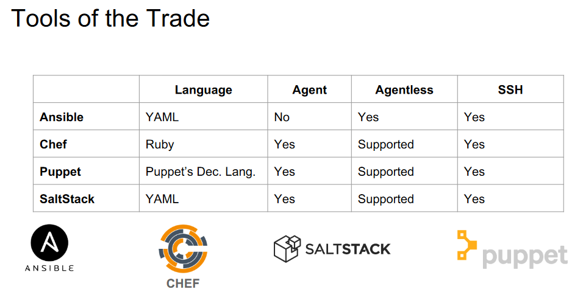


# **Provisioning and Deployment Workflow**

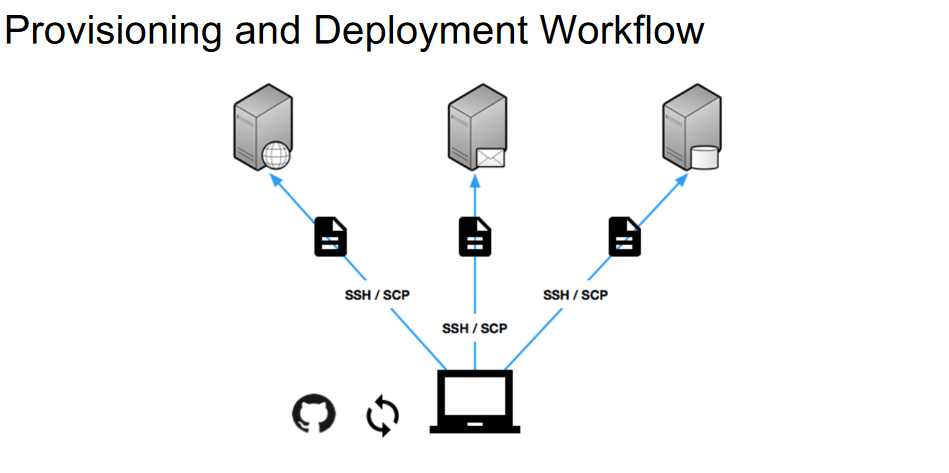


# **Ansible**

## **Ansible Vocabulary**

**Inventory:**
- **Definition:** A list of grouped deployment targets (hosts) that Ansible uses to execute tasks.
- **Usage:** Specifies the servers or systems on which Ansible should perform actions.

**Module:**
- **Definition:** A reusable work unit distributed with Ansible or developed for it.
- **Usage:** Modules are building blocks for performing tasks such as installing packages, managing files, or interacting with cloud providers.

**Task:**
- **Definition:** A combination of a module and given arguments to create an action.
- **Usage:** Represents a single unit of work performed by Ansible on a target host.

**Handlers:**
- **Definition:** Special kinds of tasks that respond to a notification triggered by other tasks.
- **Usage:** Used for actions that should be taken only when specific changes occur, reducing unnecessary executions.

**Templates:**
- **Definition:** Enable the creation of dynamic configuration files using Jinja2, the Python template engine.
- **Usage:** Allows the generation of configuration files based on dynamic data and variables.

**Role:**
- **Definition:** A reusable component that encapsulates variables, templates, tasks, handlers, and other configuration elements.
- **Usage:** Roles provide a modular and organized way to structure and reuse Ansible configurations.

**Playbook:**
- **Definition:** Describes policies for remote systems to enforce, typically composed of a set of roles and tasks.
- **Usage:** Provides a higher-level configuration that orchestrates the execution of tasks across multiple hosts.

**Jinja2:**
- **Definition:** The Python template engine used by Ansible for creating dynamic content in templates.
- **Usage:** Allows the insertion of variables, conditions, and loops into configuration files to make them adaptable and dynamic.

**Configurable:**
- **Definition:** Refers to components, such as roles, that can be adjusted or customized based on specific requirements.
- **Usage:** Provides flexibility in tailoring configurations to different environments.

**Notification:**
- **Definition:** A signal generated by tasks to which handlers respond.
- **Usage:** Triggers specific actions (handlers) based on changes or events during the execution of tasks.

In summary, Ansible uses a specific vocabulary to describe its configuration elements, including inventory, modules, tasks, handlers, templates, roles, playbooks, and other concepts. Understanding these terms is essential for effectively using Ansible for automation and configuration management.


## **Ansible Overview**

**Agentless Recipe Execution:**
- **Description:** Ansible executes recipes without requiring a dedicated agent on target hosts. It relies on SSH or local connections for communication.
- **Advantages:** Simplifies deployment and management as there is no need to install and maintain agents on remote systems.

**YAML-based Recipe Syntax:**
- **Description:** Ansible recipes, also known as playbooks, are expressed using YAML (YAML Ain't Markup Language).
- **Advantages:** YAML is human-readable, easy to write, and provides a clear structure for defining tasks and configurations.

**Module and Task Directives:**
- **Description:** Ansible uses modules to perform specific tasks on target hosts. Tasks, defined within playbooks, use modules and specify the desired state.
- **Advantages:** Encapsulates functionality into reusable modules and allows clear definition of tasks.

**Organization into Roles and Playbooks:**
- **Description:** Ansible recipes are organized into roles, encapsulating related tasks, variables, and files. Playbooks define the overall configuration, orchestrating the execution of roles.
- **Advantages:** Roles promote modularity, reusability, and a structured approach to configuration management.

**Inventory for Defining Target Hosts:**
- **Description:** Target hosts for Ansible operations are defined in the inventory. This inventory lists the hosts and groups them for efficient management.
- **Advantages:** Offers flexibility in specifying hosts, groups, and variables, allowing dynamic configuration based on the target environment.

**Idempotency through Task Execution:**
- **Description:** Ansible tasks only run if the target host differs from the expected result, ensuring idempotency. This means tasks can be safely rerun without causing unintended changes.
- **Advantages:** Guarantees consistent and predictable configurations, reducing the risk of unintended side effects during multiple executions.

**Overall Benefits:**
- **Simplicity:** Ansible simplifies configuration management through its agentless approach, YAML syntax, and modular design.
- **Consistency:** Roles, playbooks, and idempotent tasks contribute to consistent and repeatable configurations.
- **Scalability:** Ansible scales well for both small and large infrastructures, providing flexibility and ease of use.

**Considerations:**
- **SSH or Local Connections:** Ensure appropriate connectivity configurations for SSH or local connections.
- **Understanding YAML:** Familiarity with YAML syntax is essential for creating and understanding Ansible playbooks.
- **Idempotency Awareness:** Design tasks with idempotency in mind to ensure predictable and safe executions.

In summary, Ansible offers a powerful and flexible configuration management solution with its agentless approach, YAML syntax, modular design, and emphasis on idempotency. It simplifies automation, promotes consistency, and is well-suited for various infrastructure scales.


---
---


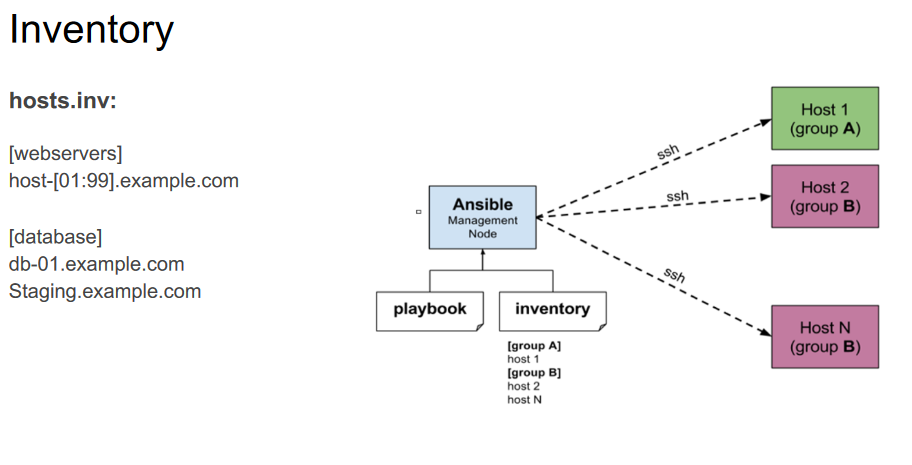


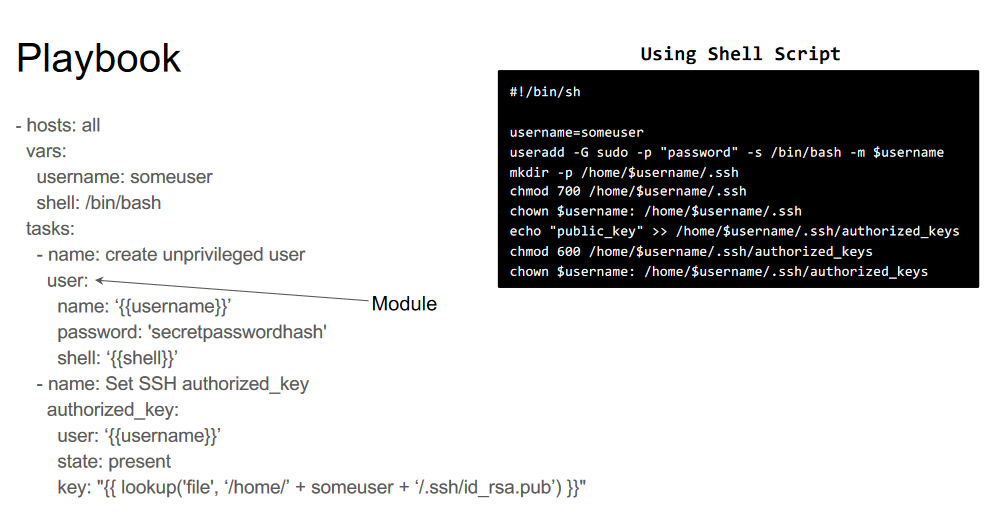


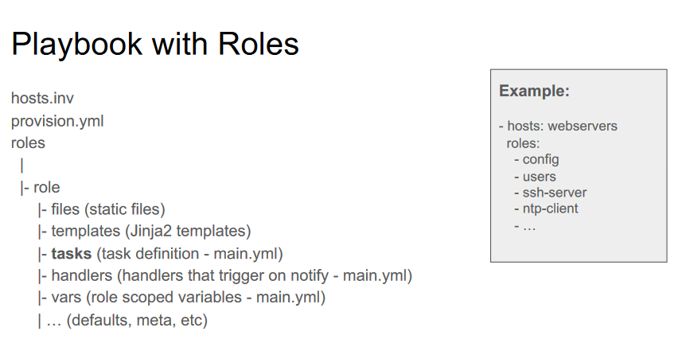


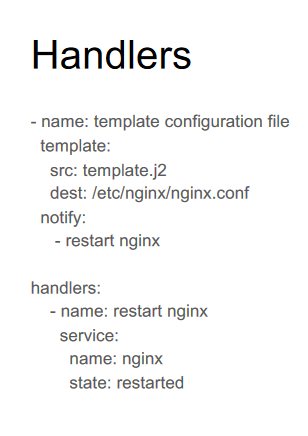

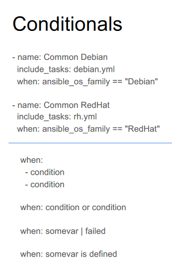

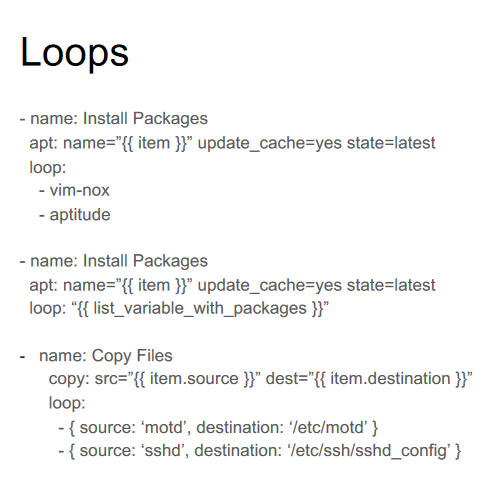

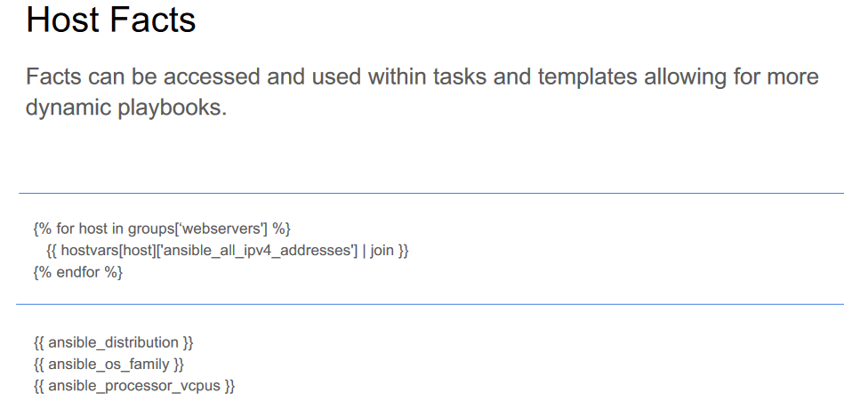


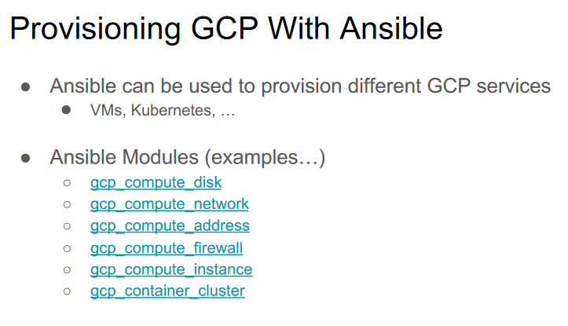

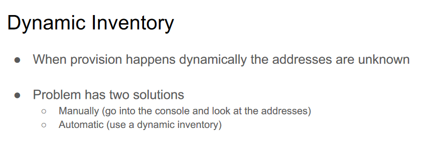