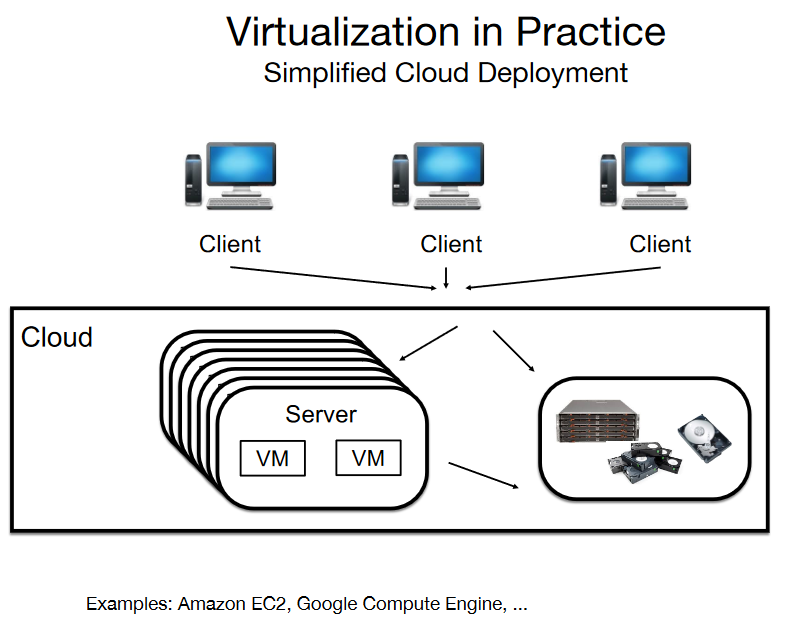

# Virtualization I - VMs

### Virtualization

**Definition:**
- **Technique for Creating Software-Based Virtual Resources:**
  - Virtualization is a technique that involves creating software-based virtual devices or resources. These virtual entities act as abstractions provided on top of existing hardware or software resources.

**Key Characteristics:**
- **Abstraction Layer:**
  - Virtualization creates an abstraction layer that separates the virtual resources from the underlying physical hardware or software.
  
- **Flexibility:**
  - It provides flexibility by allowing the creation of virtual instances of devices, servers, or entire operating systems, enabling efficient resource utilization.

- **Isolation:**
  - Virtualization enables the isolation of multiple virtual environments on a single physical system, ensuring that they operate independently of each other.

- **Resource Pooling:**
  - Resources from the underlying physical infrastructure are pooled together, and virtual instances can dynamically allocate and release these resources based on demand.

**Types of Virtualization:**
- **1. Server Virtualization:**
  - Involves creating multiple virtual servers on a single physical server, allowing for more efficient use of hardware resources.

- **2. Desktop Virtualization:**
  - Extends virtualization to desktop systems, enabling multiple virtual desktop instances to run on a single physical machine.

- **3. Network Virtualization:**
  - Focuses on creating virtualized networks that operate independently of the physical network infrastructure, enhancing flexibility and scalability.

- **4. Storage Virtualization:**
  - Involves abstracting physical storage resources to create a unified and easily managed storage pool.

**Benefits of Virtualization:**
- **1. Resource Efficiency:**
  - Virtualization optimizes resource utilization by allowing multiple virtual instances to share physical resources, reducing underutilization.

- **2. Cost Savings:**
  - It leads to cost savings through better resource utilization, reduced hardware requirements, and improved scalability.

- **3. Isolation and Security:**
  - Virtualization provides isolation between virtual instances, enhancing security by preventing interference between different environments.

- **4. Flexibility and Scalability:**
  - Virtualized environments are highly flexible, allowing for easy scaling of resources based on changing workloads.

**Considerations:**
- While virtualization offers numerous benefits, organizations should carefully plan and manage virtualized environments to ensure optimal performance, security, and resource allocation.

# Advantages

## Heterogeneity

**Virtualization Enables Heterogeneity:**

- **1. Support for Different Physical Resources:**
  - Virtualization allows the provision of virtual resources on top of different physical hardware resources. This means that diverse types of hardware can be abstracted and utilized to support virtual environments.

- **2. Shared Physical Hardware Across Applications/Services:**
  - Virtual resources, created through virtualization, can support different applications or services while utilizing the same physical hardware infrastructure. For example, multiple virtual machines (VMs) with different operating systems can coexist on the same underlying hardware.

**Key Benefits:**

- **Resource Optimization:**
  - Heterogeneity in virtualization facilitates efficient utilization of various hardware resources. Organizations can leverage existing infrastructure heterogeneity without needing dedicated hardware for each application or service.

- **Application Diversity:**
  - Different virtual resources can be tailored to support diverse applications or services, even if these applications have distinct operating system requirements or other resource specifications.

- **Improved Hardware Utilization:**
  - Virtualization enhances hardware utilization by allowing the consolidation of multiple virtual environments on a single physical server. This leads to better resource utilization and cost savings.

- **Operational Flexibility:**
  - Virtualization provides operational flexibility by enabling the deployment of varied virtual instances on a shared infrastructure. This flexibility supports dynamic allocation and reallocation of resources based on changing demands.

**Use Cases:**

- **1. Multi-Platform Support:**
  - Virtualization enables the creation of virtual instances that support different operating systems, allowing organizations to run diverse applications on the same underlying hardware.

- **2. Service Consolidation:**
  - Organizations can consolidate services or applications onto a shared virtualized infrastructure, reducing the need for separate physical servers for each service.

- **3. Efficient Resource Sharing:**
  - Heterogeneity in virtualization facilitates efficient sharing of physical resources, enabling the coexistence of diverse virtual environments.

**Considerations:**

- While heterogeneity in virtualization brings advantages, organizations should carefully plan and manage the mix of virtualized environments to ensure compatibility, performance, and optimal resource allocation.

## Transparency

**User-Friendly Interaction:**

- **Similarity to Physical Resources:**
  - Virtualization offers transparency by ensuring that user interaction with virtual resources is similar to the interaction with physical resources. Users can engage with virtual instances in a manner that closely resembles their experience with tangible, physical hardware.

**Key Benefits:**

- **Familiar User Experience:**
  - Users find a familiar and consistent experience when interacting with virtual resources. This similarity to physical resources simplifies the learning curve and minimizes the need for extensive retraining.

- **Ease of Transition:**
  - The transition from physical to virtual environments is smoother due to the transparent nature of virtualization. Users can maintain their existing workflows and practices, reducing resistance to adopting virtualized solutions.

- **Efficient Resource Management:**
  - Transparent user interaction supports efficient resource management as users can apply their existing knowledge and skills to interact with virtual instances. This familiarity enhances productivity and reduces the likelihood of errors.

**Use Cases:**

- **1. Virtual Machines (VMs):**
  - Users interact with virtual machines in a manner similar to physical servers. They can access and manage VMs using standard protocols and interfaces, making the experience transparent and intuitive.

- **2. Cloud-Based Services:**
  - Cloud services built on virtualization maintain transparency, allowing users to interact with cloud resources as if they were physical, on-premises components. This seamless interaction promotes user acceptance and adoption.

- **3. Network Virtualization:**
  - In network virtualization, users can manage virtual networks using familiar tools and protocols, maintaining transparency in network operations.

**Considerations:**

- While transparency in virtualization enhances user experience, organizations should ensure that proper training and documentation are provided to help users adapt to any nuances or additional features introduced by virtualized environments.

## Isolation

**Isolation in Virtualization:**

- **Virtual Resource Isolation:**
  - Virtualization ensures the isolation of virtual resources from each other. This isolation extends to various aspects, including security, performance, and resilience to failures.

**Key Benefits:**

- **1. Security Isolation:**
  - Virtualization provides security isolation, preventing one virtual resource from accessing or impacting the data and processes of another. This enhances overall system security and mitigates the risk of unauthorized access.

- **2. Performance Isolation:**
  - Depending on the virtualized resource and configuration, virtualization supports performance isolation. This ensures that the resource demands of one virtual instance do not significantly impact the performance of others sharing the same infrastructure.

- **3. Failure Isolation:**
  - Isolation extends to failures, including operating system issues or data corruption. Failures in one virtual resource are contained, preventing them from affecting the stability and integrity of other virtual instances.

**Use Cases:**

- **1. Multi-Tenant Environments:**
  - In cloud computing or multi-tenant environments, isolation is crucial. Virtualization allows multiple users or organizations to share the same physical infrastructure while ensuring isolation in terms of security, performance, and failure resilience.

- **2. Server Virtualization:**
  - Server virtualization isolates different applications or services running on separate virtual machines. Failures or security incidents in one VM do not propagate to others, maintaining a secure and stable environment.

- **3. Containerization:**
  - In containerized environments, virtualization technologies provide isolation between containers, preventing conflicts and ensuring that each container operates independently.

**Considerations:**

- While virtualization offers isolation benefits, proper configuration and monitoring are essential to ensure effective isolation and prevent potential performance bottlenecks or security vulnerabilities. Organizations should also consider the specific requirements of their applications and services when implementing virtualization for optimal results.

## Resource Optimization

**Leveraging Physical Resources for Efficiency:**

- **1. Efficient Use of Physical Resources:**
  - Virtualization enables the efficient use of physical resources by allowing them to be leveraged to support more clients or applications. This optimization enhances overall resource utilization.

- **2. Server Consolidation:**
  - Virtualization facilitates server consolidation, where multiple virtual instances or workloads can run on a single physical server. This consolidation reduces the need for maintaining a large number of physical servers.

- **3. Lower Costs:**
  - Resource optimization through virtualization contributes to lower costs. By maximizing the use of existing infrastructure, organizations can achieve cost savings related to hardware procurement, maintenance, and operational expenses.

**Key Benefits:**

- **Increased Workload Capacity:**
  - Virtualization allows organizations to increase the capacity of their infrastructure by running multiple virtual instances on a single physical server. This increased workload capacity supports business scalability.

- **Reduced Hardware Footprint:**
  - Server consolidation leads to a reduced hardware footprint, minimizing the physical space required for data centers. This reduction has implications for both cost savings and environmental sustainability.

- **Optimized Energy Consumption:**
  - Fewer physical servers result in optimized energy consumption. By reducing the number of servers in operation, organizations can lower power consumption and associated costs.

**Use Cases:**

- **1. Data Center Efficiency:**
  - Virtualization is widely used in data centers to optimize resource utilization, leading to improved efficiency and performance.

- **2. Cloud Service Providers:**
  - Cloud service providers leverage virtualization to efficiently allocate resources among numerous clients, ensuring optimal utilization and cost-effectiveness.

- **3. Legacy System Migration:**
  - Organizations migrating from legacy systems to virtualized environments benefit from resource optimization, allowing them to extend the lifespan of existing hardware.

**Considerations:**

- While resource optimization is a significant advantage, organizations should monitor and manage virtualized environments to prevent resource contention and ensure optimal performance for all hosted applications and services.

## Simplified Management

**Simplified Management of Virtual Resources:**

- **1. Ease of Management:**
  - Managing virtual resources is simpler compared to managing bare-metal infrastructure. Virtualization abstracts complexities, offering streamlined and centralized management.

- **2. Migration and Backup Simplicity:**
  - Virtualization simplifies tasks such as migration and backup of virtual machines (VMs). These operations can be carried out more easily compared to their counterparts in a bare-metal environment.

**Key Benefits:**

- **Centralized Administration:**
  - Virtualization centralizes administration tasks, allowing administrators to efficiently oversee and manage multiple virtual instances from a single interface.

- **Resource Allocation and Scaling:**
  - Administrators can easily allocate resources and scale virtual instances based on demand. This flexibility simplifies the adjustment of computing resources to meet changing workloads.

- **Efficient Resource Monitoring:**
  - Virtualization platforms often provide tools for efficient resource monitoring, aiding administrators in identifying performance bottlenecks and optimizing resource usage.

**Use Cases:**

- **1. Data Center Operations:**
  - In data centers, virtualization simplifies the overall management of servers, ensuring more efficient utilization, and easing tasks such as provisioning and monitoring.

- **2. Disaster Recovery:**
  - Virtualization enhances disaster recovery capabilities by simplifying the process of backing up and restoring virtual machines. This simplification accelerates recovery times.

- **3. Cloud Environments:**
  - Cloud service providers leverage virtualization for simplified management of resources, allowing them to efficiently allocate and manage virtual instances across a large infrastructure.

**Considerations:**

- While virtualization simplifies management, organizations should still implement robust monitoring and governance practices to ensure the health and performance of virtualized environments. Additionally, training for administrators is crucial to maximize the benefits of simplified management.

# Disadvantages

## Performance

**Performance Implications in Virtualization:**

- **1. Performance Penalty:**
  - The virtualization of resources often introduces a performance penalty, impacting various aspects such as CPU, Network I/O, and Storage I/O.

**Key Considerations:**

- **CPU Performance Overhead:**
  - Virtualization introduces overhead in terms of CPU utilization. The additional layer of abstraction and the need for resource sharing among virtual instances can lead to a reduction in CPU performance.

- **Network I/O Impact:**
  - Virtualized environments may experience a performance impact on Network I/O. The sharing of network resources among multiple virtual instances can result in latency and reduced network throughput.

- **Storage I/O Challenges:**
  - Storage I/O performance may be affected due to the virtualization layer. The shared access to storage resources by multiple virtual instances can lead to contention and impact overall storage I/O performance.

**Mitigation Strategies:**

- **1. Resource Allocation Planning:**
  - Organizations should carefully plan resource allocations to mitigate the performance impact. Allocating sufficient resources to virtual instances, considering the specific needs of each workload, can help address performance challenges.

- **2. Performance Monitoring and Optimization:**
  - Implementing robust performance monitoring tools and practices is essential. Regular monitoring allows organizations to identify bottlenecks and optimize resource usage to enhance overall system performance.

- **3. Hardware Acceleration:**
  - Leveraging hardware acceleration features, such as CPU virtualization extensions, can help mitigate the CPU performance overhead associated with virtualization.

**Use Cases:**

- **1. High-Performance Computing (HPC):**
  - Environments requiring extremely high CPU, network, or storage performance, such as those in high-performance computing, may experience challenges in achieving optimal performance in virtualized settings.

- **2. Real-Time Systems:**
  - Real-time systems with stringent performance requirements may find it challenging to meet latency and throughput demands in virtualized environments.

**Considerations:**

- While virtualization offers numerous benefits, organizations should assess the specific performance requirements of their workloads and implement appropriate mitigation strategies to address any performance penalties associated with virtualization.

## Overprovisioning

**Overprovisioning Challenges in Virtualization:**

- **1. Overprovisioning Risks:**
  - Deploying more virtualized resources than physically available ones may lead to overprovisioning, posing risks of performance degradation and inefficient resource utilization.

**Key Considerations:**

- **Resource Exhaustion:**
  - Overprovisioning occurs when virtual instances are allocated resources beyond the capacity of the physical infrastructure. This can lead to resource exhaustion and negatively impact the performance of all virtualized workloads.

- **Diminished Quality of Service (QoS):**
  - The quality of service (QoS) for virtual instances may deteriorate when overprovisioning takes place. Virtual machines competing for scarce resources can experience increased latency, reduced throughput, and degraded overall performance.

- **Increased Operational Costs:**
  - Overprovisioning contributes to increased operational costs, as organizations may invest in additional hardware to address the performance degradation caused by resource oversubscription.

**Mitigation Strategies:**

- **1. Capacity Planning:**
  - Organizations should engage in rigorous capacity planning to accurately assess the resource requirements of their workloads. This helps avoid overprovisioning and ensures optimal resource allocation.

- **2. Monitoring and Scaling Policies:**
  - Implementing robust monitoring tools and scaling policies is essential. Automated scaling based on workload demands can help dynamically adjust resource allocations, preventing overprovisioning during peak usage.

- **3. Resource Reservation:**
  - Utilizing resource reservation features in virtualization platforms allows organizations to guarantee a minimum level of resources for critical workloads, mitigating the risks of overprovisioning.

**Use Cases:**

- **1. Dynamic Workload Environments:**
  - Environments with dynamically changing workloads are particularly susceptible to overprovisioning. Continuous monitoring and adaptive scaling are crucial to avoid resource bottlenecks.

- **2. Cloud Service Providers:**
  - Cloud service providers need to carefully manage resource allocation to prevent overprovisioning, as they cater to diverse workloads with varying resource demands.

**Considerations:**

- Overprovisioning challenges underscore the importance of careful planning, monitoring, and automation in virtualized environments. Organizations should align resource allocations with actual workload requirements to ensure optimal performance and cost-effectiveness.

## Security

**Security Implications in Virtualization:**

- **1. Isolation and Unauthorized Access:**
  - If isolation is not properly addressed or if a malicious user or system administrator gains unauthorized access to the physical resources (e.g., server), the security of all virtualized resources may be compromised.

**Key Considerations:**

- **Isolation Breaches:**
  - Inadequate isolation between virtual instances may lead to security breaches. A malicious actor with access to one virtualized resource may attempt to exploit vulnerabilities or gain unauthorized access to other virtual instances on the same infrastructure.

- **Unauthorized System Administration:**
  - Malicious system administrators, with access to the underlying physical resources, can potentially compromise the security of all virtualized resources. Unauthorized administrative access poses a significant security risk in virtualized environments.

- **Shared Vulnerabilities:**
  - Shared vulnerabilities among virtual instances may result in widespread security issues. Exploiting a vulnerability in one virtual machine could potentially impact the security of other co-located virtual machines.

**Mitigation Strategies:**

- **1. Robust Isolation Mechanisms:**
  - Implementing robust isolation mechanisms between virtual instances is crucial. Technologies such as hypervisors and containerization platforms should be configured securely to prevent unauthorized access.

- **2. Access Control Policies:**
  - Enforcing strict access control policies helps limit access to virtualized resources. Proper authentication, authorization, and auditing mechanisms should be in place to prevent unauthorized individuals from compromising the security of the environment.

- **3. Periodic Security Audits:**
  - Conducting periodic security audits and vulnerability assessments helps identify and address potential security gaps. Regular reviews of access logs and system activities enhance the ability to detect and respond to security incidents.

**Use Cases:**

- **1. Multi-Tenant Cloud Environments:**
  - Multi-tenant cloud environments are particularly vulnerable to security risks. Proper isolation and access control measures are essential to mitigate the potential impact of security breaches.

- **2. Privileged User Management:**
  - Organizations need to carefully manage access privileges, especially for privileged users, to prevent unauthorized actions that could compromise the security of virtualized resources.

**Considerations:**

- Addressing security concerns in virtualized environments requires a comprehensive approach that combines technological measures, access controls, and ongoing monitoring. Organizations should stay vigilant and proactive in safeguarding their virtualized infrastructure against potential security threats.

## Dependability

**Dependability Risks in Virtualization:**

- **1. Cascading Failures:**
  - The failure of a physical resource may result in the failure of multiple virtual instances, leading to cascading failures and potential disruptions in service dependability.

**Key Considerations:**

- **Shared Infrastructure Risks:**
  - Virtualized environments share underlying physical resources. If a critical component, such as a server or storage device, experiences a failure, it can impact multiple virtual instances hosted on that infrastructure.

- **Single Point of Failure:**
  - The reliance on a shared physical infrastructure introduces a single point of failure. Failures in the underlying hardware or infrastructure components can have a broad impact, affecting the dependability of all virtualized workloads.

- **Resource Contention:**
  - Resource contention, particularly during high-demand periods, may lead to performance degradation and potential reliability issues. Virtual instances vying for shared resources can experience increased latency and reduced responsiveness.

**Mitigation Strategies:**

- **1. Redundancy and High Availability:**
  - Implementing redundancy and high availability configurations can mitigate the impact of physical resource failures. This involves distributing workloads across multiple physical servers and ensuring failover mechanisms are in place.

- **2. Disaster Recovery Planning:**
  - Develop comprehensive disaster recovery plans to address scenarios where physical resources or infrastructure components fail. This includes regular backups, data replication, and the ability to restore services in alternative locations.

- **3. Resource Monitoring and Load Balancing:**
  - Proactive resource monitoring and load balancing help prevent resource contention and ensure equitable distribution of workloads. Load balancing techniques can optimize resource utilization and enhance dependability.

**Use Cases:**

- **1. Critical Business Applications:**
  - Organizations running critical business applications in virtualized environments must prioritize dependability. Implementing failover mechanisms and redundancy is essential for maintaining service continuity.

- **2. Cloud Service Reliability:**
  - Cloud service providers need to address dependability concerns by deploying resilient architectures, considering the potential impact of infrastructure failures on the reliability of hosted services.

**Considerations:**

- Ensuring dependability in virtualized environments requires a holistic approach that includes redundancy, disaster recovery planning, and continuous monitoring. Organizations should carefully design and manage their virtualized infrastructure to minimize the risks associated with shared dependencies.

---
---

# **Virtual Machines**

**Resource Consolidation and OS Flexibility:**

- **1. Costly OS Migration Challenges:**
  - Changing an application or service to run on different Operating Systems (OSs) is a costly and challenging task, often requiring significant time and resources.

- **2. VMs Enable OS Diversity:**
  - Virtual Machines (VMs) address the challenges of OS migration by allowing the simultaneous operation of different OSs on top of the same physical server. This capability supports resource consolidation and flexibility in choosing the most suitable OS for specific workloads.

**Key Considerations:**

- **OS-Independent Application Deployment:**
  - VMs enable the deployment of applications independent of the underlying OS. This flexibility allows organizations to choose the most appropriate OS for each application without the need for extensive modifications.

- **Efficient Resource Utilization:**
  - Resource consolidation is achieved through the simultaneous operation of multiple VMs on a single physical server. This efficient utilization of resources contributes to cost savings and improved infrastructure efficiency.

- **Isolation of Environments:**
  - VMs provide isolated environments for running different OSs and applications. This isolation ensures that changes or issues in one VM do not impact others, enhancing system stability and reliability.

**Use Cases:**

- **1. Legacy Application Support:**
  - Organizations with legacy applications designed for specific OSs can leverage VMs to continue running these applications without the need for immediate migration to newer environments.

- **2. Development and Testing:**
  - VMs are commonly used in software development and testing environments, allowing developers to test applications on various OS configurations without the need for dedicated physical hardware.

- **3. Server Consolidation:**
  - VMs support server consolidation by enabling the hosting of multiple virtual instances on a single physical server. This consolidation reduces the need for maintaining a large number of physical machines.

**Considerations:**

- While VMs offer flexibility and resource consolidation benefits, organizations should carefully manage VM configurations, monitor performance, and consider factors such as security and licensing when deploying and operating virtualized environments.

## Historical Context

**Evolution from Mainframes to X86 Virtualization:**

- **1. Mainframe System Isolation (Approximately 45 Years Ago):**
  - IBM mainframe systems pioneered the concept of allowing applications to use isolated portions of a given system's resources. This early form of virtualization provided a degree of resource isolation and contributed to efficient system utilization.

- **2. Mainstream Adoption in the Early 2000s (X86 Architecture):**
  - Virtualization became mainstream in the early 2000s, primarily with the X86 server architecture. This shift was driven by several factors:

    - **a. Under-Utilized Resources:**
      - X86 servers often operated with under-utilized resources, leading to inefficiencies in terms of both computing power and infrastructure utilization.

    - **b. Infrastructure Costs:**
      - The rising costs associated with maintaining and expanding physical infrastructure prompted organizations to explore virtualization as a solution to optimize resource usage and reduce overall infrastructure costs.

**Key Milestones:**

- **1. IBM Mainframes:**
  - The early adoption of virtualization on IBM mainframes laid the foundation for the concept of isolating applications within a shared computing environment, providing a model for efficient resource utilization.

- **2. X86 Server Architecture:**
  - The X86 server architecture, prevalent in the early 2000s, became a focal point for virtualization efforts. Virtual Machines (VMs) on X86 servers allowed for the creation of isolated environments, each capable of running different operating systems and applications.

**Impact on Computing Landscape:**

- **1. Efficiency and Flexibility:**
  - Virtualization brought about increased efficiency and flexibility in deploying and managing computing resources. Organizations could run multiple virtual instances on a single physical server, leading to improved resource utilization and operational flexibility.

- **2. Cost Savings:**
  - The adoption of virtualization was driven by the potential for significant cost savings. By consolidating workloads onto fewer physical servers, organizations could achieve cost efficiencies in terms of hardware, maintenance, and power consumption.

**Considerations:**

- Understanding the historical context of virtualization highlights its evolution from early mainframe systems to widespread adoption on X86 architectures. The key drivers, including resource under-utilization and infrastructure costs, shaped the trajectory of virtualization in the computing landscape.

### Virtual Machines: Host's CPU and Time Slicing

**CPU Utilization and Time Slicing:**

- **1. Time Slicing:**
  - In virtualized environments, processing requests are time-sliced and shared across Virtual Machines (VMs). This approach is similar to running multiple processes concurrently on the host system.

- **2. Overcommitting vCPUs and Performance Impact:**
  - Overcommitting virtual Central Processing Units (vCPUs) occurs when the total number of allocated vCPUs across VMs exceeds the physical CPU capacity of the host. This overcommitment may lead to poor performance and resource contention.

**Key Considerations:**

- **Time Slicing Mechanism:**
  - Time slicing involves allocating CPU time to each VM in a cyclical manner. VMs take turns utilizing the host's CPU, allowing multiple VMs to run simultaneously.

- **Similarity to Running Multiple Processes:**
  - The concept is analogous to running multiple processes on the host system, where each process is allocated CPU time in a time-sliced manner.

- **Overcommitting vCPUs:**
  - Overcommitting vCPUs can occur when the aggregate demand for CPU resources from VMs exceeds the host's physical CPU capacity. This can lead to performance degradation, increased response times, and potential resource contention.

**Mitigation Strategies:**

- **1. Capacity Planning:**
  - Organizations should engage in thorough capacity planning to avoid overcommitting vCPUs. Understanding the workload demands and allocating resources accordingly helps prevent performance issues.

- **2. Monitoring and Adjustment:**
  - Continuous monitoring of CPU usage and performance metrics is essential. If overcommitment is detected, adjustments should be made to resource allocations, and additional physical CPU resources may need to be provisioned.

- **3. Load Balancing:**
  - Implementing load balancing mechanisms helps distribute CPU load across the available resources. Load balancing ensures that VMs are allocated CPU time proportionally, preventing resource imbalances.

**Use Cases:**

- **1. Dynamic Workload Environments:**
  - Environments with dynamic and varying workloads are particularly susceptible to overcommitting vCPUs. Monitoring and adapting resource allocations are critical in such scenarios.

- **2. Cloud Service Providers:**
  - Cloud service providers, serving diverse workloads from multiple clients, need effective mechanisms to manage CPU resources and prevent overcommitment.

**Considerations:**

- Balancing CPU resources in virtualized environments requires careful planning and monitoring. Organizations should aim to optimize resource allocations, avoid overcommitment, and ensure satisfactory performance for all hosted VMs.

### Virtual Machines: Host's RAM and Persistent Storage

**Allocation of RAM and Persistent Storage:**

- **1. RAM Allocation:**
  - Each Virtual Machine (VM) allocates a specific portion of the host's Random Access Memory (RAM) capacity for its operations. This allocation allows multiple VMs to run concurrently on the same physical server.

- **2. Persistent Storage Allocation:**
  - Similarly, VMs allocate a portion of the host's persistent storage, which can include Solid State Drives (SSD), Hard Disk Drives (HDD), or other storage mediums. This allocation provides each VM with its storage space for data and applications.

**Shared Storage Efficiency:**

- **1. Efficient Handling of Multiple Writers/Readers:**
  - Storage shared across VMs must efficiently handle multiple writers and readers. Shared storage resources, such as network-attached storage or storage area networks, play a crucial role in facilitating data access and ensuring data integrity.

**Storage Resource Allocation Strategies:**

- **1. Dynamic Resource Allocation:**
  - Storage resources can be dynamically allocated to VMs based on their requirements. This dynamic allocation allows for flexibility and efficient use of storage capacity.

- **2. Thin Provisioning:**
  - Storage resources can be allocated using thin provisioning, where only the space currently needed by a VM is allocated on the physical storage. This approach optimizes storage utilization and reduces wasted space.

**Mitigation Strategies:**

- **1. Monitoring Storage Performance:**
  - Continuous monitoring of storage performance is essential to identify any bottlenecks or performance issues. This helps in optimizing storage configurations and addressing potential challenges.

- **2. Quality of Service (QoS) for Storage:**
  - Implementing Quality of Service policies for storage ensures that each VM gets a fair share of storage resources. QoS controls can prevent resource contention and maintain performance levels.

- **3. Regular Capacity Planning:**
  - Regular capacity planning exercises help organizations anticipate storage requirements and allocate resources accordingly. This proactive approach avoids storage shortages and ensures smooth VM operations.

**Use Cases:**

- **1. Database Virtualization:**
  - Virtualizing databases often involves managing large amounts of data. Efficient allocation and management of RAM and storage resources are crucial for the optimal performance of virtualized databases.

- **2. Virtual Desktop Infrastructure (VDI):**
  - VDI environments, where multiple virtual desktops share common storage, benefit from efficient storage handling to provide a seamless user experience.

**Considerations:**

- Effective management of RAM and persistent storage is fundamental to the performance and reliability of virtualized environments. Organizations should adopt strategies that optimize resource utilization, provide efficient shared storage, and ensure the scalability of storage capacity as needed.

### Virtual Machines: Host's Network Configuration

**Sharing Network Bandwidth and Configurations:**

- **1. Shared Network Bandwidth:**
  - Virtual Machines (VMs) share the host's network bandwidth, allowing multiple VMs to utilize the same network infrastructure concurrently.

- **2. Different Network Setups:**
  - VMs can be configured with different network setups to suit specific use cases and requirements.

**Network Configuration Options:**

- **1. Host-Only Configuration:**
  - - Shares the host's networking namespace.
    - The VM only has access to the host's network.
    - This configuration provides isolation, and the VM is restricted to communication within the host environment.

- **2. NAT (Network Address Translation) Configuration:**
  - - Masks network activity as if it is done by the host, presenting a single network identity externally.
    - The VM has access to external resources through the host's network.
    - NAT configuration allows multiple VMs to share a single external IP address, enhancing security and conserving IP addresses.

- **3. Bridge Configuration:**
  - - Uses the hypervisor to assign a specific IP to the VM.
    - The VM is seen as another node in the physical network, with its unique IP address.
    - Bridge configuration enables the VM to function as a distinct entity on the network, facilitating direct communication with other nodes.

**Mitigation Strategies:**

- **1. Network Segmentation:**
  - Segmenting the network based on the specific requirements of VMs helps optimize bandwidth usage and enhances security by controlling communication flows.

- **2. Security Policies:**
  - Implementing security policies, such as firewalls and access controls, ensures that VMs operate within defined security boundaries and prevents unauthorized access.

- **3. Quality of Service (QoS):**
  - Applying Quality of Service policies helps prioritize network traffic, ensuring that critical applications or VMs receive sufficient bandwidth for optimal performance.

**Use Cases:**

- **1. Development and Testing Environments:**
  - Host-only configurations are commonly used in development and testing environments where VMs need to operate in isolation without external network access.

- **2. Internet Access for VMs:**
  - NAT configurations are suitable for VMs requiring internet access while sharing a common external IP address.

- **3. Integrated Network Nodes:**
  - Bridge configurations are beneficial when VMs need to be seamlessly integrated into the physical network as individual nodes.

**Considerations:**

- Configuring VM networking involves making choices based on the desired level of isolation, external access requirements, and the need for VMs to function as distinct entities within a broader network context.

### Virtualization Modes: Full Virtualization

**Characteristics:**

- **1. Guest OS Abstraction:**
  - The Guest Operating System (OS) is fully abstracted from the underlying host's hardware, creating a virtualized environment where the guest OS operates without direct interaction with the physical hardware.

- **2. Examples:**
  - Examples of full virtualization include platforms like VirtualBox.

**Advantages:**

- **1. No Guest OS Modifications:**
  - No modifications to the guest OS are required, leading to a higher range of supported OS flavors. This also facilitates easier migration and portability of Virtual Machines (VMs) across different host environments.

**Disadvantages:**

- **1. Performance Implications:**
  - Guest OS instructions must be translated, potentially resulting in lower Input/Output (I/O) and Central Processing Unit (CPU) performance.

- **2. Hardware-Assisted Virtualization:**
  - Hardware-assisted virtualization, leveraging technologies like Intel VT-x or AMD-V, is used to mitigate the performance penalty associated with instruction translation.

---

### Virtualization Modes: Paravirtualization

**Characteristics:**

- **1. Guest OS Modifications:**
  - Paravirtualization requires hooks or modifications at the guest OS level, enabling it to communicate directly with the hypervisor without relying on instruction translation.

- **2. Examples:**
  - Examples of paravirtualization include hypervisors like Xen.

**Advantages:**

- **1. Improved CPU and I/O Performance:**
  - By bypassing the translation of costly OS instructions, paravirtualization achieves better CPU and I/O performance as the guest OS communicates directly with the hypervisor.

**Disadvantages:**

- **1. Guest OS Modifications:**
  - The guest OS must be modified to support paravirtualization, which can impact maintainability and portability. This modification requirement may be a drawback in certain scenarios.

**Considerations:**

- The choice between full virtualization and paravirtualization depends on factors such as performance requirements, compatibility with different OS flavors, and the trade-off between ease of use and system optimizations.

### Virtualization Types: Type 1 - Bare Metal Hypervisor

**Characteristics:**

- **1. Absence of General-Purpose OS:**
  - The hypervisor does not require a general-purpose operating system at the host server. Instead, it operates directly on the hardware.

- **2. Deployed as a "Small Operating System":**
  - The bare metal hypervisor is deployed directly on hardware and functions as a "small operating system" responsible for managing virtualized environments.

- **3. Examples:**
  - Examples of Type 1 hypervisors include VMware ESX.

**Advantages:**

- **1. Enhanced Performance:**
  - Running directly on hardware provides better performance compared to scenarios where a general-purpose operating system is interposed between the hardware and the hypervisor.

**Considerations:**

- **1. Hardware Virtualization Support:**
  - Type 1 hypervisors typically require specific virtualization support at the hardware level. This support, such as Intel VT-x or AMD-V, facilitates efficient virtualization and performance optimizations.

**Use Cases:**

- **1. Server Virtualization:**
  - Type 1 hypervisors are commonly used in server virtualization scenarios where performance is a critical consideration, and the hypervisor interacts directly with the hardware.

- **2. Data Center Environments:**
  - Deployments in data center environments, especially where virtualization support at the hardware level is available, benefit from the performance advantages of Type 1 hypervisors.

**Considerations:**

- While Type 1 hypervisors offer enhanced performance, their suitability depends on hardware support and the specific requirements of the virtualization environment.

### Virtualization Types: Type 2 - Hosted Hypervisor

**Characteristics:**

- **1. Deployment on General-Purpose OS:**
  - The hypervisor is deployed on top of a general-purpose operating system (OS), creating a layered virtualization setup.

- **2. Examples:**
  - Examples of Type 2 hypervisors include VirtualBox.

**Advantages:**

- **1. Ease of Deployment:**
  - Type 2 hypervisors are easier to deploy since they run on top of a general-purpose OS without the need for direct hardware interaction.

**Disadvantages:**

- **1. Performance Limitations:**
  - Performance is typically lower compared to Type 1 hypervisors because the hypervisor operates within the context of a general-purpose OS, which is not optimized for virtualization purposes.

**Hybrid Solutions:**

- **1. KVM and Xen:**
  - KVM (Kernel-based Virtual Machine) and Xen represent hybrid solutions. While they are Type 2 hypervisors, their hypervisors require installing specific kernel modules on top of general-purpose OSs, introducing elements of Type 1 functionality.

**Considerations:**

- Type 2 hypervisors are suitable for scenarios where ease of deployment is a priority, and performance considerations are secondary. Hybrid solutions like KVM and Xen offer a compromise by introducing certain optimizations while still running on top of a general-purpose OS.
