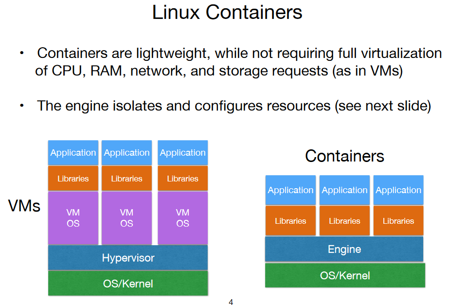
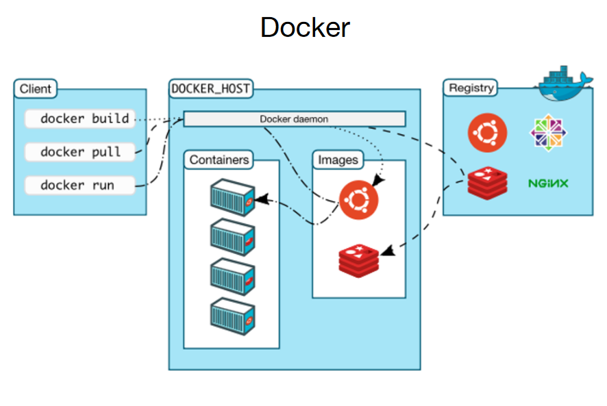

# **Containers**

**Characteristics:**

- **1. Lightweight Virtual Environment:**
  - Containers are lightweight virtual environments that efficiently group and isolate a set of processes and associated resources. These resources can include memory, CPU, disk space, and more.

- **2. Isolation from Host and Other Containers:**
  - Containers provide isolation for the encapsulated processes and resources, ensuring that they operate independently of the host system and other containers. This isolation enhances security and prevents interference between different containerized applications.

**Advantages:**

- **1. Resource Efficiency:**
  - Containers share the host OS kernel, making them more resource-efficient compared to traditional virtualization solutions. They consume less overhead and enable faster startup times.

- **2. Portability:**
  - Containers encapsulate both the application and its dependencies, ensuring portability across different environments. This portability simplifies deployment and facilitates consistent application behavior across various platforms.

- **3. Scalability:**
  - Containers are highly scalable, allowing for the easy deployment and management of multiple instances of containerized applications. They are well-suited for dynamic and scalable environments.

**Use Cases:**

- **1. Microservices Architecture:**
  - Containers are commonly used in microservices architectures, where applications are decomposed into small, independently deployable units. Each microservice can run in its own container.

- **2. Continuous Integration/Continuous Deployment (CI/CD):**
  - Containers play a crucial role in CI/CD pipelines, providing a consistent environment for testing and deployment throughout the software development lifecycle.

- **3. Cloud-Native Applications:**
  - Cloud-native applications, designed to leverage cloud infrastructure efficiently, often utilize containers for their lightweight and portable nature.

**Considerations:**

- Containers offer a balance between resource efficiency, portability, and scalability, making them well-suited for modern application deployment and management scenarios.

## Linux Containers

**Characteristics:**

- **1. Compartmentalization of Host System:**
  - The host system is compartmentalized for each container, providing isolation in terms of CPU, I/O (memory, disk, network), and other resources.

- **2. Shared Hardware and Kernel/OS:**
  - Each container shares the underlying hardware and the kernel/Operating System (OS) with the host system. This shared environment contributes to the lightweight nature of Linux containers.

- **3. Isolation Between Containers:**
  - Containers are isolated from each other, ensuring that processes and resources within one container do not interfere with those in other containers. This isolation enhances security and maintains a clear separation between containerized applications.

**Advantages:**

- **1. Lightweight Resource Sharing:**
  - Linux containers leverage shared resources efficiently, consuming less overhead compared to traditional virtualization. They share the host OS kernel, contributing to their lightweight nature.

- **2. Efficient Utilization of Resources:**
  - Resource compartmentalization allows for efficient utilization of CPU, memory, disk, and network resources. Containers can be optimized for specific workloads without impacting other containers or the host system.

**Use Cases:**

- **1. Application Deployment:**
  - Linux containers are widely used for deploying and running applications in a lightweight, portable, and consistent environment.

- **2. Server Consolidation:**
  - Containers enable server consolidation by efficiently running multiple isolated workloads on a single host, optimizing resource usage.

- **3. Microservices Architecture:**
  - In microservices architectures, Linux containers facilitate the deployment and scaling of individual microservices independently.

**Considerations:**

- Linux containers offer a balance between resource efficiency, isolation, and flexibility, making them a popular choice for various application deployment scenarios.

### Linux Containers: Building Blocks

**Namespaces (Isolation):**

- **Definition:**
  - Namespaces are a component of the Linux Kernel that enables the isolation of global host resources, making them appear as dedicated resources for a group of processes running within the same namespace.

- **Functionality:**
  - Namespaces allow the sharing of host resources, such as network and storage (filesystem), across different containers without conflicts. Each container operates within its isolated namespace, ensuring independence.

**Control Groups (Resource Management):**

- **Definition:**
  - Control Groups (cgroups) are a Linux Kernel feature that enables the allocation of resources (CPU, RAM, Disk I/O, network bandwidth) among groups of processes.

- **Functionality:**
  - Control Groups provide resource management capabilities, allowing administrators to limit the amount of resources used by each container. This includes controlling parameters like storage space, ensuring fair resource distribution.

**SELinux (Security):**

- **Definition:**
  - SELinux (Security-Enhanced Linux) is a Linux Kernel security module that provides additional security measures beyond namespaces. It prevents a container from compromising the host system and other containers.

- **Functionality:**
  - SELinux enforces access control and security policies, enhancing the overall security posture of Linux containers. It ensures that containers operate within predefined security boundaries, preventing unauthorized access and potential security breaches.

**Considerations:**

- These building blocks—Namespaces, Control Groups, and SELinux—form the foundation of Linux containers, enabling isolation, resource management, and security. Their effective combination contributes to the efficiency and reliability of containerized environments.

### Linux Containers: Types

**OS Containers (e.g., LXC):**

- **Definition:**
  - OS Containers, exemplified by technologies like LXC (Linux Containers), simulate a "lightweight" operating system within a container. These containers run multiple processes, offering an environment that resembles a complete operating system.

- **Characteristics:**
  - - Simulates the functionality of an entire operating system within the container.
    - Runs multiple processes, providing a comprehensive and self-contained environment.

**Application Containers (e.g., Docker):**

- **Definition:**
  - Application Containers, represented by platforms like Docker, are designed specifically for deploying applications. In this context, each application is treated as an independent process within its container.

- **Characteristics:**
  - - Focuses on deploying individual applications in isolated environments.
    - Each application runs as an independent process within its container.
    - Optimized for simplicity and efficiency in application deployment.

**Considerations:**

- - OS Containers are suitable for scenarios where a more comprehensive operating system simulation is required within the container, allowing the execution of multiple processes.
  - Application Containers are well-suited for deploying individual applications in a lightweight and portable manner. They simplify the deployment process and enhance scalability.

# Docker

### Docker Components

**Docker Client:**

- **Definition:**
  - The Docker Client is a component used by users to interact with the Docker platform. It exposes the Docker API, enabling users to perform various operations, including running and managing containers, managing networks, reading logs and metrics, and pulling and managing images.

**Docker Daemon:**

- **Definition:**
  - The Docker Daemon utilizes the Docker API and is responsible for receiving requests from the Docker Client. It manages Docker Images, Containers, and Networks, executing the requested operations on behalf of the user.

**Docker Objects:**

- **Image:**
  - An Image is an immutable (unchangeable) file that contains the source code, libraries, and other files needed for an application to run. It serves as a template for creating runnable instances.

- **Container:**
  - A Container is a runnable instance of an Image. It represents an isolated environment where an application can execute with its dependencies and configurations.

**Docker Registry:**

- **Definition:**
  - The Docker Registry is a repository of Docker Images. It serves as a centralized location where Docker users can store, share, and access container images. An example of a Docker Registry is https://store.docker.com.

**Considerations:**

- Docker components work together to facilitate the building, managing, and running of containerized applications. The Docker Client provides a user interface, while the Docker Daemon handles the execution of operations. Images and Containers are fundamental concepts, and the Docker Registry serves as a centralized hub for sharing and accessing images.

# Kubernetes

**Overview:**

- **Definition:**
  - Kubernetes is a container orchestration platform that automates the deployment, scaling, and management of containerized applications. It provides features for network management, modular storage orchestration, simplified scheduling, self-healing, and scale-out capabilities for containers.

**Key Features:**

- **1. Network Management:**
  - Kubernetes includes features such as service discovery and load balancing, enhancing network management for containerized applications.

- **2. Modular Storage Orchestration:**
  - The platform supports modular storage orchestration, allowing integration with various storage solutions such as iSCSI, NFS, Ceph, AWS, and GCP.

- **3. Simplified Scheduling, Self-Healing, and Scale-Out:**
  - Kubernetes simplifies the deployment process through efficient scheduling, provides self-healing mechanisms, and supports seamless scale-out for containers.

**Kubernetes Cluster:**

- **1. Clients and Master Node Interaction:**
  - Clients interact with the Master node, typically through the `kubectl` command-line tool.

- **2. Master Node Management:**
  - The Master node manages the Kubernetes cluster, overseeing worker nodes, pods, network configurations, storage, and other aspects of the containerized environment.

**Considerations:**

- Kubernetes serves as a powerful tool for managing containerized applications at scale. Its cluster architecture, with a Master node orchestrating the entire system, provides a robust foundation for deploying and managing container workloads efficiently.

### Kubernetes: Pod, Deployment, and Service

**Pod:**

- **Definition:**
  - A Pod is a computing unit in Kubernetes composed of one or more application containers. Containers within a Pod share the same network namespace and can communicate with each other using localhost. Common container runtimes include Docker, containerd, and CRI-O.

**Deployment:**

- **Definition:**
  - A Deployment in Kubernetes specifies the runtime environment for Pods. It includes information such as the number of replicas (instances) of a Pod that should be running at any given time. Deployments facilitate the management and scaling of application instances.

**Service:**

- **Definition:**
  - A Service in Kubernetes exposes a group of Pods (representing an application) as a network service. It provides a stable endpoint (IP address and port) that can be used to access the application. Services enable load balancing and service discovery within the Kubernetes cluster.

**Network:**

- **Network:**
  - Each Pod in Kubernetes has a unique cluster-wide IP address. Networking across Pods, even on distinct worker nodes, can be managed through networking overlays such as Flannel or Calico. These overlays facilitate communication between Pods.

**Storage:**

- **Storage:**
  - Pods in Kubernetes can access storage volumes provided by different storage backends, including iSCSI, NFS, AWS, and GCP. Storage in Kubernetes can be categorized into ephemeral storage (available during the Pod's lifetime) and persistent storage (available even if the Pod is terminated).

**Considerations:**

- Pods, Deployments, and Services are fundamental concepts in Kubernetes, forming the building blocks for deploying, managing, and exposing containerized applications. Networking and storage aspects enhance the flexibility and scalability of Kubernetes deployments.

# Containers vs VMs

### Summary: Containers vs VMs

**Disclaimer:**

- **Each Technology's Purpose:**
  - Both containers and virtual machines (VMs) are designed with different goals, and the choice between them depends on the specific use case.

- **Use Cases:**
  - **VMs:**
    - VMs are beneficial when full server (OS) virtualization is required.
    - Useful for scenarios where encapsulating an entire operating system is necessary.

  - **Containers:**
    - Containers are valuable for managing different libraries and applications efficiently.
    - Well-suited for lightweight and portable application deployment.

**Considerations:**

- The decision to use VMs or containers should align with the specific requirements of the use case. VMs provide full isolation and encapsulation, making them suitable for certain scenarios. On the other hand, containers excel in managing diverse libraries and applications in a lightweight manner. The choice depends on factors such as resource utilization, isolation needs, and deployment characteristics.

### Advantages of Containers over VMs

1. **Faster Testing/Provisioning/Migration:**
   - Containers offer faster testing, provisioning, and migration compared to virtual machines. Their lightweight nature allows for quick instantiation and efficient resource utilization.

2. **Better Resource Utilization and Performance:**
   - Containers are more lightweight than virtual machines, resulting in better resource utilization. They share the host OS kernel and require fewer resources, leading to improved performance and efficiency.

3. **Deployment Flexibility:**
   - Containers can be deployed on both physical and virtualized servers, providing flexibility in choosing the deployment environment. This adaptability simplifies the deployment process across various infrastructure setups.

**Considerations:**

- The advantages of containers, including speed, resource efficiency, and deployment flexibility, make them a preferred choice for certain use cases where rapid development, scalability, and efficient resource utilization are crucial.

### Disadvantages of Containers over VMs

1. **Weaker Isolation/Security:**
   - Containers share the host OS kernel, which can result in weaker isolation compared to virtual machines. If a security vulnerability is exploited at the kernel level, it may affect all containers on the host.

2. **Less Flexibility in Running Different OSs:**
   - Containers have less flexibility in running different operating systems compared to virtual machines. While containers are primarily designed for Linux-based applications, VMs can support a wider range of OSs, including Linux, Windows, BSD, and others.

**Considerations:**

- The disadvantages of containers, such as weaker isolation and limited OS support, should be considered in scenarios where strong isolation or diverse OS environments are critical requirements. It's important to choose the technology that aligns with the specific security and compatibility needs of the application.
