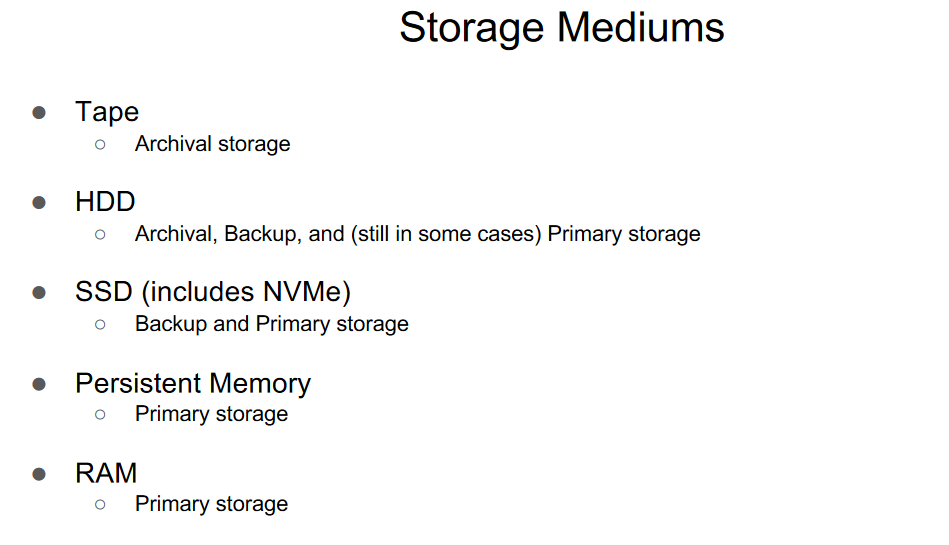
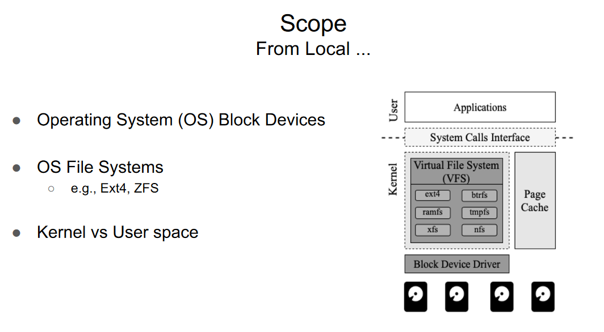
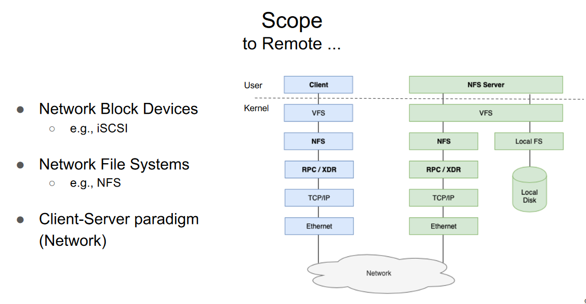
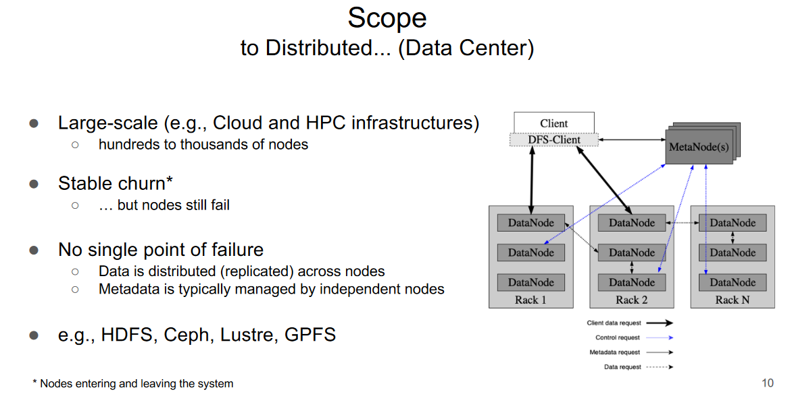
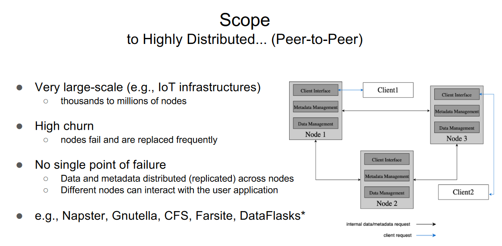
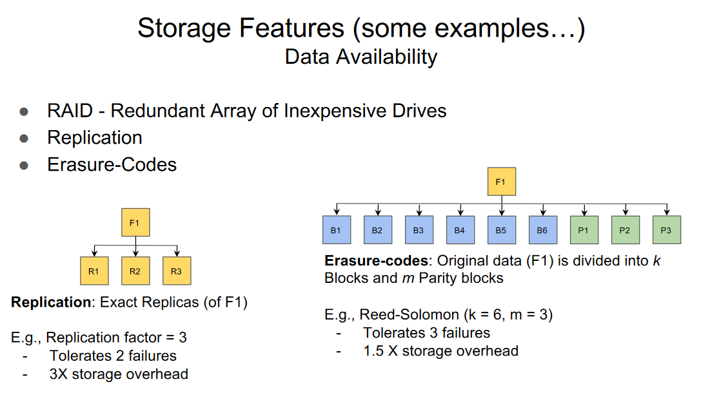
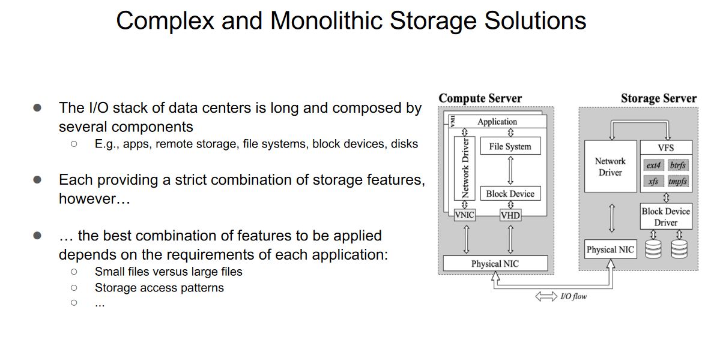
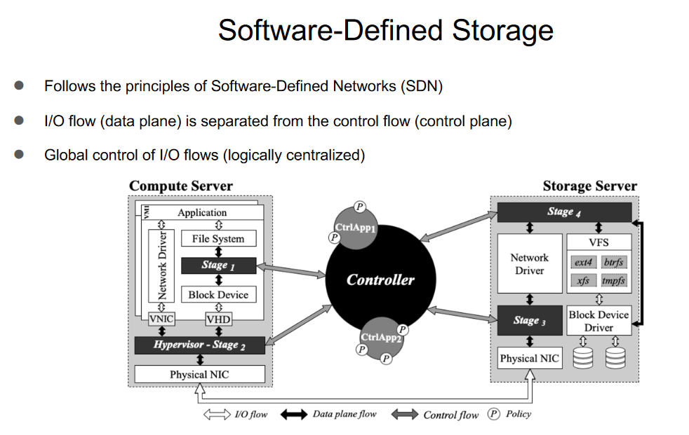

# Storage

### Storage: Relevance and Importance

**Why are Storage Systems Relevant?**

1. **Cornerstone for Data Management Infrastructures:**
   - Storage systems serve as the cornerstone for various data management infrastructures and systems across different domains, including Cloud, High-Performance Computing (HPC), Internet of Things (IoT), databases, analytics, machine learning, and more.

2. **Support for Various Applications:**
   - Storage systems play a crucial role in supporting a wide range of applications, including databases, analytics, machine learning, and other data-intensive tasks. They provide the foundation for managing and retrieving data efficiently.

3. **Data Persistency and Availability:**
   - Storage systems ensure data persistency, meaning that data remains available and accessible even after the application or system is shut down. This persistence is vital for preserving important information and enabling data-driven applications.

4. **Performance is Key:**
   - The performance of storage systems is paramount, as slow data storage and retrieval directly impact application speed. Fast and efficient storage solutions contribute to the overall responsiveness and performance of applications.

**Considerations:**

- Storage systems form the backbone of modern data-driven ecosystems, enabling data persistency, availability, and efficient performance. The choice of storage solutions is critical to meeting the specific requirements of different applications and use cases.

## Storage Types

**1. Archival Storage:**

- **Purpose:**
  - Data is stored for archival purposes, where throughput is favored over latency. This type of storage is optimized for efficiently reading and writing large amounts of data in a sequential manner.

- **Characteristics:**
  - Sequential workloads.
  - Write-once data (typically).
  - Examples include Amazon Glacier, a cloud service designed for archival storage.

**2. Backup Storage:**

- **Purpose:**
  - Backup storage is used for storing data backups, prioritizing throughput over latency. It is designed to efficiently handle the writing and reading of large amounts of data, typically in sequential workloads.

- **Characteristics:**
  - Sequential workloads (mainly).
  - In some cases, data can be updated sporadically and in-place.
  - In some cases, only differentials (modified data) are stored across backups of the same source.
  - Examples include Amazon S3, a cloud service commonly used for backup storage.

**3. Primary Storage:**

- **Purpose:**
  - Primary storage, not limited to RAM, supports databases, analytics, virtual machines (VMs), and more. This type of storage prioritizes high throughput and low latency for efficiently handling large amounts of data with both sequential and random workloads.

- **Characteristics:**
  - Sequential and random workloads.
  - Data and metadata-intensive workloads.
  - Data can be updated frequently.
  - Examples include Amazon EBS, a cloud service providing primary storage support.

**Considerations:**

- Different storage types cater to specific use cases, optimizing for factors such as throughput, latency, and workload patterns. The choice of storage depends on the nature of the data and the requirements of the applications or systems.

## Storage Interfaces

**1. Block Device:**

- **Definition:**
  - In a block device interface, data is managed as blocks. Examples of block device implementations include iSCSI, Amazon EBS, and Ceph. Block devices are typically used at the hardware level and allow for low-level access to data storage.

**2. File System:**

- **Definition:**
  - In a file system interface, data is managed as a hierarchy of files. Examples of file systems include Ext4, Lustre, and Ceph. File systems provide a higher-level abstraction, organizing data into files and directories, and are commonly used in operating systems.

**3. Object Storage:**

- **Definition:**
  - In an object storage interface, data is managed as objects. Examples of object storage implementations include Amazon S3, OpenStack Swift, and Ceph. Object storage is designed for large-scale, distributed data storage and retrieval, treating data as discrete objects with unique identifiers.

**Considerations:**

- Storage interfaces determine how data is organized, accessed, and managed. The choice of interface depends on the specific requirements of the application or system, considering factors such as data structure, access patterns, and scalability.

## Scope: From Local to Highly Distributed

**1. From Local to Remote:**
   - **Local (Operating System Level):**
     - OS Block Devices.
     - OS File Systems (e.g., Ext4, ZFS).
     - Kernel vs User Space.
   - **Remote (Network Level):**
     - Network Block Devices (e.g., iSCSI).
     - Network File Systems (e.g., NFS).
     - Client-Server Paradigm (Network).

**2. To Distributed (Data Center):**
   - Large-scale environments (e.g., Cloud and HPC infrastructures).
   - Hundreds to thousands of nodes.
   - Stable churn (nodes still fail but with a predictable rate).
   - No single point of failure:
     - Data is distributed (replicated) across nodes.
     - Metadata is typically managed by independent nodes.
   - Examples: HDFS, Ceph, Lustre, GPFS.

**3. To Highly Distributed (Peer-to-Peer):**
   - Very large-scale environments (e.g., IoT infrastructures).
   - Thousands to millions of nodes.
   - High churn:
     - Nodes fail and are replaced frequently.
   - No single point of failure:
     - Data and metadata are distributed (replicated) across nodes.
     - Different nodes can interact with the user application.
   - Examples: Napster, Gnutella, CFS, Farsite, DataFlasks.

**Considerations:**
- The scope of storage systems spans from local storage at the operating system level to highly distributed, peer-to-peer environments. Each level introduces unique challenges and design considerations based on the scale, churn, and fault tolerance requirements.

## Storage Features

### Storage Features: Data Availability

**1. RAID - Redundant Array of Inexpensive Drives:**
   - **Description:**
     - RAID configurations involve combining multiple disk drives into a single logical unit to improve data performance, redundancy, or both.
   - **Example:**
     - RAID 1 mirrors data across multiple drives for redundancy.

**2. Replication:**
   - **Description:**
     - Replication involves creating exact replicas of the original data on different storage devices or nodes. This ensures redundancy and availability in case of failures.
   - **Example:**
     - Replication factor = 3 indicates that there are three identical copies of the data.
     - Tolerates a specified number of failures depending on the replication factor.

**3. Erasure-Codes:**
   - **Description:**
     - Erasure coding is a method of data protection where the original data is divided into blocks and additional parity blocks are created. This provides fault tolerance by allowing recovery from data loss.
   - **Example:**
     - Reed-Solomon erasure code with parameters (k = 6, m = 3) means original data is divided into 6 blocks and 3 parity blocks.
     - Tolerates a specified number of failures (e.g., 3 in this case) with a storage overhead factor (e.g., 1.5X).

**Considerations:**
- These features enhance data availability by introducing redundancy and fault tolerance mechanisms. The choice of the method depends on factors such as storage overhead, tolerance to failures, and specific use case requirements.

### Storage Features: Performance Optimizations

**1. Data Locality:**
   - **Description:**
     - Data locality focuses on optimizing performance by bringing computation closer to the storage devices or servers holding the data. This involves co-locating storage and processing on the same server or device.
   - **Examples:**
     - HBase and HDFS: These systems emphasize co-location of storage and processing for improved performance.
     - Active Storage: An approach where computation is pushed closer to storage devices.

**2. Caching:**
   - **Description:**
     - Caching is a technique that involves keeping frequently accessed data closer to the client or accessible from a faster source to reduce latency and avoid waiting for data retrieval from local or remote storage.
   - **Examples:**
     - File System Page Cache: A mechanism in file systems that caches frequently used data in memory for faster access.
     - Alluxio: An in-memory distributed file system that utilizes caching to enhance data access speed.

**Considerations:**
- Performance optimizations aim to reduce latency and improve overall system efficiency by strategically managing data placement and access patterns. The use of data locality and caching can significantly enhance storage system performance.

### Storage Features: Space Efficiency

**1. Compression:**
   - **Description:**
     - Compression is a technique used to reduce the size of data by eliminating redundant content, such as repeated patterns of bytes, inside and across files. It is typically applied as a static approach.
   - **Examples:**
     - Usage of algorithms like gzip or zlib to compress files and save storage space.

**2. Deduplication:**
   - **Description:**
     - Deduplication involves eliminating redundant copies of data within a storage system, whether they are files or blocks. It is a dynamic technique that identifies and removes duplicate data to save storage space.
   - **Examples:**
     - Identifying and eliminating duplicate files or blocks to store only unique instances of the data.

**Considerations:**
- Space efficiency features like compression and deduplication contribute to optimizing storage usage by reducing redundant data and conserving storage space. These techniques are valuable for systems where storage costs are a critical consideration.

### Storage Features: Security

**1. Data Encryption:**
   - **Description:**
     - Data encryption is a security measure that protects sensitive information by converting it into a coded format. There are two primary forms:
       - **Encryption at Rest:**
         - Data is encrypted before being stored persistently, ensuring that even if physical storage media are compromised, the data remains unreadable without proper decryption.
       - **Encryption in Transit:**
         - Data is encrypted at the client premises before being transmitted through the network, providing security for data during transit (e.g., for remote storage systems).
   - **Examples:**
     - Tools and protocols like BitLocker, dm-crypt, or HTTPS for securing data at rest and in transit.

**2. Access Control:**
   - **Description:**
     - Access control mechanisms are implemented to prevent unauthorized access to users' data. This involves defining and enforcing policies to regulate who can access, modify, or delete specific data.
   - **Examples:**
     - Role-based access control (RBAC), file permissions, and authentication systems to ensure only authorized users can interact with the stored data.

**Considerations:**
- Security features like data encryption and access control are crucial for protecting sensitive information and ensuring that only authorized users have the appropriate level of access to stored data.

### Complex and Monolithic Storage Solutions

- The I/O stack of data centers is extensive, consisting of various components such as applications, remote storage, file systems, block devices, and disks.

- Each component in the I/O stack typically provides a specific combination of storage features. However, the ideal combination of features depends on the unique requirements of each application, considering factors like:
  - Size of files (small versus large)
  - Storage access patterns

- It's essential to recognize that the diverse needs of different applications may require tailored storage solutions. The complexity and monolithic nature of traditional storage solutions might not be the most efficient or cost-effective approach for every use case.

### Software-Defined Storage

**Principles:**
- Software-Defined Storage (SDS) follows the principles of Software-Defined Networks (SDN).

**Architecture:**
1. **I/O Flow Separation:**
   - The I/O flow (data plane) is separated from the control flow (control plane).
   - Global control of I/O flows is logically centralized.

2. **Data Plane:**
   - **Layered Approach:**
     - The data plane is organized into stages, each handling requests at the I/O path and providing different functionalities (e.g., caching, compression, encryption).
   - Programmable and extensible design allows customization and adaptation to specific requirements.

3. **Control Plane:**
   - **Distributed and Dependable:**
     - The control plane is distributed and ensures dependability.
   - Global visibility of applications, stages, and infrastructure resources.
   - Configures and tunes data plane stages to enforce I/O policies, guided by Control Applications.
     - Examples include Quality of Service (e.g., I/O fairness or prioritization) and transformations (e.g., encryption, compression).

**Considerations:**
- Software-Defined Storage aims to provide a flexible and programmable storage infrastructure by separating the data and control planes. This allows for centralized control and the ability to adapt storage functionalities based on application needs.
