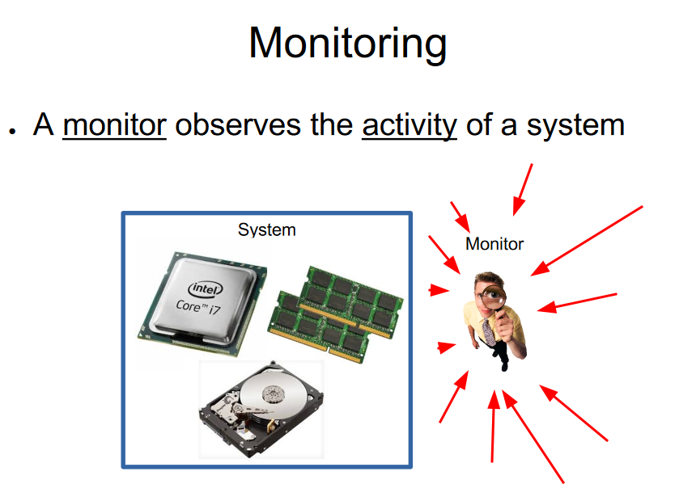
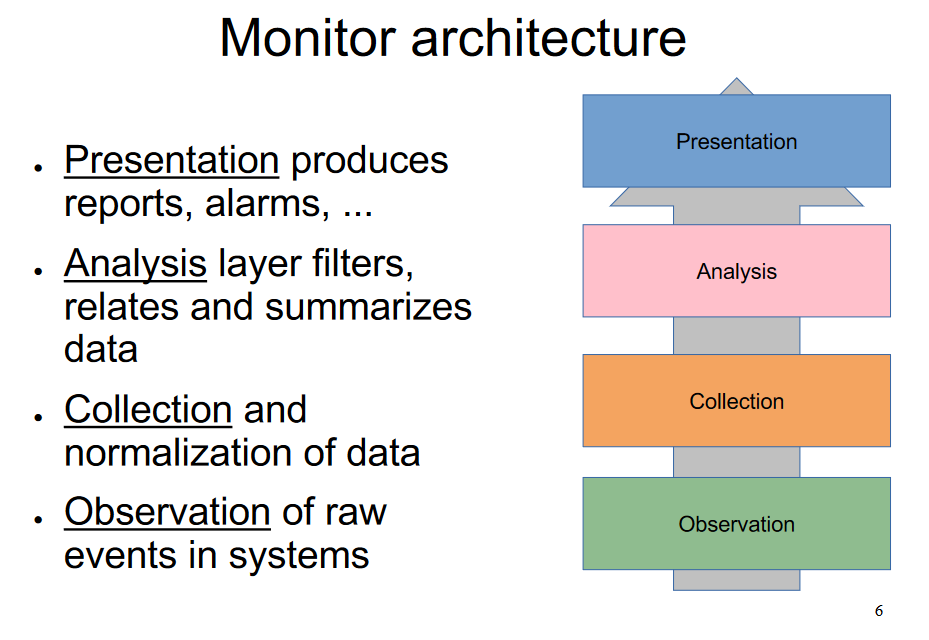
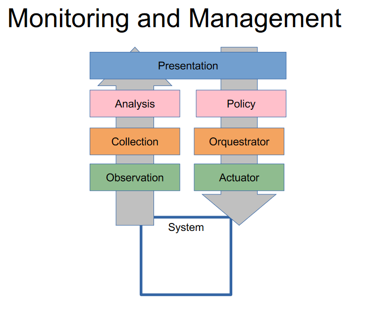

# **Monitoring**

## Monitoring Concepts

- **System Components:**
  - A system comprises both physical and logical resources, each having a state.
  
- **State and Events:**
  - The state of these resources can change over time due to various events.

- **Trace and Logging:**
  - A trace is a log of events.
  - It typically includes:
    - Time stamps for each event.
    - Variable details capturing the specifics of each event.

- **Monitoring Domain:**
  - The domain refers to the set of activities observed by the monitoring system.

- **Detail Variability:**
  - The level of detail in monitoring can vary:
    - In time according to the input rate of events.
    - In scope, according to the resolution chosen for observation.

- **Overhead Implications:**
  - Implementing monitoring imposes overhead on the system, potentially altering the observed activity.

  ## Monitor Classification

- **Event-Driven vs Sampling:**
  - **Event-Driven:**
    - Observation is triggered by specific events.
  - **Sampling:**
    - Observation occurs at regular intervals, sampling the system state.

- **On-Line vs Batch:**
  - **On-Line:**
    - Observation is available in real-time.
  - **Batch:**
    - Observation is collected and processed in batches at specified intervals.

- **Hardware vs Software:**
  - **Hardware:**
    - Monitoring involves the use of dedicated hardware components.
  - **Software:**
    - Monitoring is implemented through software-based solutions.

- **Centralized vs Distributed:**
  - **Centralized:**
    - Monitoring is concentrated in a single location or system.
  - **Distributed:**
    - Monitoring is distributed across multiple locations or systems.

## Monitor Architecture

### Monitoring : Observation

- **Passive Observation or Spying:**
  - Involves monitoring without actively interacting with the system.
  - Example: Network sniffer.

- **Instrumentation:**
  - Utilizes built-in counters in the system, including both hardware and operating system metrics.
  - Involves log generation.

- **Probing with Additional Requests:**
  - Involves actively sending requests to the system for observation.
  - Example: Ping.

- **Examples:**
  - Example tool: Beats

### Monitoring: Collection

- **Push Data vs Pull Data:**
  - **Push Data:**
    - Data is actively sent to a central collection point.
  - **Pull Data:**
    - Collection points retrieve data from monitored entities.
  - *Depends on configuration, legacy systems, etc.*

- **Reliability and Persistence:**
  - Ensures the reliability and persistence of collected data.

- **Time Synchronization in Distributed Systems:**
  - Maintains consistent time across distributed systems for accurate correlation of events.

- **Examples:**
  - Example tools: collectd, logstash

### Monitoring: Analysis

- **Data Processing Tasks:**
  - Involves tasks such as processing time series data and conducting searches.
  
- **"Big Data" in Large Infrastructures:**
  - Deals with the challenges of handling and analyzing large volumes of data in extensive infrastructures.

- **Examples:**
  - Example tools: Elasticsearch, Graphite

### Monitoring: Presentation

- **Goals:**
  - Presentation aims to achieve performance metrics, error detection, and configuration tracking.

- **Results:**
  - Includes alert generation and graphical presentation of monitored data.

- **Examples:**
  - Example tools: Kibana, Grafana

