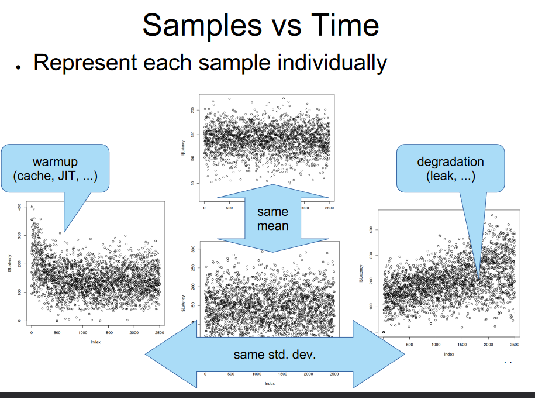

# **Benchmarking**

## Benchmarking: Workload

- **Trace from a Real System:**
  - Challenges include scalability and availability.

- **Generate Synthetic Requests:**
  - Selection of a subset of operations with random parameters.
  - Non-uniform random distribution (Zipf).

- **Schedule Requests:**
  - Concurrent requests and inter-arrival time (Exponential).

## Benchmarking: Environment

- **Hardware:**
  - Includes models (CPU, RAM, GPU, Disk, etc.) and configurations (number of CPUs, amount of RAM, etc.).

- **Software:**
  - Encompasses the operating system, libraries, and components of the System Under Test (SUT).

### Measuring

- **Collect Samples:**
  - Gather data points from the system, representing measurements of interest.

- **Summarize with Mean and Standard Deviation:**
  - Calculate the average (mean) of the collected samples to provide a central measure.
  - Compute the standard deviation to understand the dispersion or variability in the data.

- **Expressing as a Single Number:**
  - While mean and standard deviation offer insights, sometimes a single number is desired for simplicity.
  - Possible options:
    - **Median:** Represents the middle value of a dataset, less sensitive to extreme values.
    - **Percentiles:** Indicate the value below which a given percentage of observations fall (e.g., 95th percentile).
    - **Coefficient of Variation (CV):** Expresses the standard deviation as a percentage of the mean, providing a relative measure of variability.

- Selecting the appropriate summary metric depends on the specific characteristics and requirements of the measurement.

### Samples vs Time

- **Individual Samples:**
  - Represent each collected sample individually.
  - Useful for observing patterns, outliers, and trends over time.
  - Considerations:
    - **Same Mean:** Look for consistent behavior around the mean.
    - **Same Std. Dev.:** Assess variations in the data over time.
    - **Warmup:** Identify the initial phase where system parameters stabilize.
    - **Degradation:** Detect performance issues or anomalies (e.g., memory leaks).

### Samples vs Frequency

- **Frequency Representation:**
  - Aggregate samples based on their frequency.
  - Options:
    - **Histogram:** Visualizes the distribution of data, highlighting modes and symmetry.
    - **Empirical Cumulative Distribution Function (ECDF):**
      - Illustrates the cumulative probability distribution.
      - Useful for SLA compliance analysis (e.g., 95% response time).

### Summarizing Samples

- **Central Tendency Measures:**
  - Choose appropriate measures based on the characteristics of the data:
    - **Mean:** The average value.
    - **Mode:** The most frequently occurring value.
    - **Median:** The middle value when the data is sorted.
    - **High Percentile:** Identify extreme values (e.g., 95th percentile for SLA).

- **Uncertainty and Variability:**
  - **Confidence Interval (CI):**
    - A range of values that likely contains the true parameter with a certain confidence level.
  - **Coefficient of Variation (C.O.V):**
    - Relative measure of variability.
    - Calculated as the ratio of standard deviation to the mean, often expressed as a percentage.

### Common Mistakes in Benchmarking

1. **Lack of Clear Goals:**
   - Without well-defined goals, benchmarking efforts may lack focus and fail to provide meaningful insights.

2. **Unsystematic Approach:**
   - Reproducibility is Crucial:
     - Ensure that benchmarking processes are well-documented and can be replicated.
     - Lack of systematic procedures can compromise the reliability of results.

3. **Unrepresentative Workloads and Metrics:**
   - Use representative workloads that simulate real-world scenarios.
   - Metrics should align with the specific goals and characteristics of the system being evaluated.

4. **Incorrect Analysis and Presentation:**
   - Misinterpretation of results can lead to flawed conclusions.
   - Ensure that analysis methods are appropriate for the data and that results are presented accurately.

### Conclusion on System Benchmarking

1. **Multiple Dimensions:**
   - System benchmarking involves various dimensions, including workload, environment, and measurement metrics.

2. **Understanding Measurements:**
   - Key Considerations:
     - Account for warm-up and cool-down periods.
     - Inspect samples over time for stability.
     - Examine the Empirical Cumulative Distribution Function (ECDF) for distribution characteristics.

3. **Summarization for Reproducibility:**
   - Summarize benchmark results using appropriate metrics.
   - Emphasize the importance of reproducibility in benchmarking for reliable performance evaluation.

System benchmarking is a complex process that requires careful consideration of various factors to ensure meaningful and reproducible results.
