# Main Concerns: Why Distributed Systems?

- **Modularity, Decoupling Different Concerns:**

  - **Motivation:**
    - Distributed systems allow for the modularization and decoupling of different concerns within a software application.
  - **Benefits:**
    - Components in a distributed system can be developed, deployed, and updated independently, promoting flexibility and ease of maintenance.
    - Modularity facilitates parallel development efforts and enables the use of diverse technologies for different components.

- **Performance:**

  - **Motivation:**
    - Distributed systems aim to improve performance by distributing processing load across multiple nodes.
  - **Benefits:**
    - Parallel processing and load balancing enhance system throughput and responsiveness.
    - Scalability is achieved by adding more resources, enabling the system to handle increasing workloads.

- **Dependability:**
  - **Motivation:**
    - Dependability is a critical concern to ensure the reliability and availability of a system.
  - **Benefits:**
    - Redundancy and fault tolerance mechanisms in distributed systems enhance resilience against failures.
    - Geographical distribution and data replication contribute to data durability and disaster recovery.

In summary, the main concerns driving the adoption of distributed systems include achieving modularity for flexible development, improving performance through parallel processing and scalability, and ensuring dependability through redundancy and fault tolerance mechanisms.

---

# Main architectures: how to distribute?

## Monolithic System with Multiple Functionalities

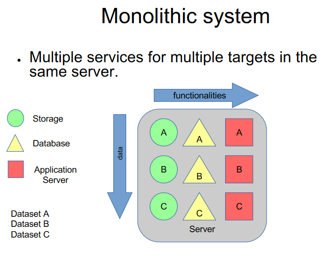

A monolithic system with multiple functionalities typically involves organizing various services within the same server. This architecture is characterized by:

- **Single Server:**

  - All functionalities and services reside on a single server.

- **Repetition of Services:**

  - The lettered sections (A, B, C) represent different functionalities or services within the monolithic system.

- **Duplication for Targets:**

  - Each functionality (A, B, C) may be duplicated to serve multiple targets, leading to a repetition of services.

- **Challenges:**

  - **Resource Allocation:**
    - Resource allocation is shared among all functionalities on the same server.
  - **Scaling Challenges:**
    - Scaling individual functionalities independently can be challenging, as they are tightly coupled within the monolith.

- **Considerations:**
  - **Maintenance:**
    - Maintenance and updates may involve the entire monolith, impacting all functionalities simultaneously.
  - **Resource Efficiency:**
    - Resource utilization needs to be carefully managed to avoid over-provisioning or underutilization.

In summary, a monolithic system with multiple functionalities on the same server may face challenges related to resource allocation, scaling, and maintenance. It contrasts with distributed systems where services are decoupled and distributed across different nodes for improved scalability and flexibility.

## Distributed System: Main Distribution Concerns

In distributed systems, addressing the challenges of scalability and performance involves focusing on key distribution concerns:

- **Replication:**

  - **Objective:**
    - Replication involves creating copies of data or services across multiple nodes or locations.
  - **Benefits:**
    - Enhances fault tolerance by providing redundancy.
    - Improves data availability and read performance by allowing access to local copies.

- **Partitioning:**

  - **Objective:**
    - Partitioning, or sharding, involves dividing data or services into partitions distributed across multiple nodes.
  - **Benefits:**
    - Enables horizontal scaling by distributing the workload across nodes.
    - Enhances parallelism and performance by processing subsets of data concurrently.

- **Service-Orientation:**

  - **Objective:**
    - Service-orientation involves structuring a system as a collection of independent services that communicate with each other.
  - **Benefits:**
    - Promotes modularity and ease of development.
    - Facilitates independent scaling and deployment of services.

- **Addressing Scaling Out:**

  - **Objective:**
    - All of these distribution concerns—replication, partitioning, and service-orientation—aim to scale out a service or application.
  - **Benefits:**
    - Scaling out supports increased capacity, responsiveness, and fault tolerance.

- **Combination:**
  - **Note:**
    - These distribution concerns are not mutually exclusive and can be combined as needed.
    - For example, a distributed system may employ both replication and partitioning strategies to achieve high availability and scalability simultaneously.

In summary, addressing the scaling challenges in distributed systems involves considering replication, partitioning, and service-orientation. These concerns are often combined to create robust, scalable, and fault-tolerant distributed architectures.

## Replication in Distributed Systems

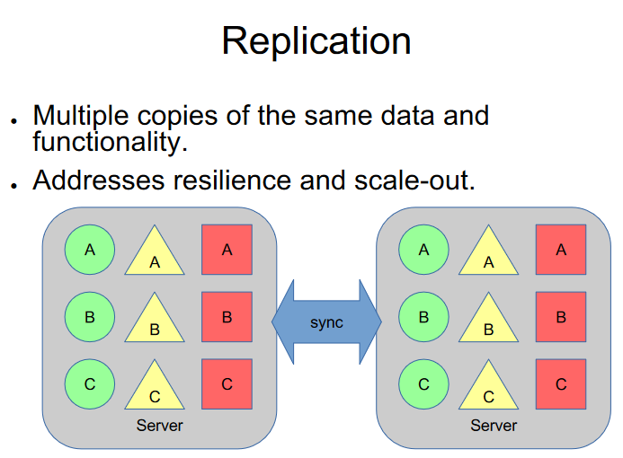

- **Multiple Copies of the Same Data and Functionality:**

  - **Definition:**
    - Replication involves creating and maintaining multiple copies of the same data or functionality across distributed nodes in a system.
  - **Data Replication:**
    - In the context of data, this means having identical copies of datasets across different servers or locations.
  - **Functionality Replication:**
    - In the context of functionality, this means deploying and running the same service or application logic across multiple nodes.

- **Addresses Resilience and Scale-Out:**

  - **Resilience:**
    - Replication enhances system resilience by providing redundancy. If one node fails, other copies can continue to serve the data or functionality.
  - **Scale-Out:**
    - Replication also addresses the need for scale-out by distributing the load across multiple instances, improving performance and accommodating a larger number of users or requests.

- **Benefits:**

  - **Fault Tolerance:**
    - Provides fault tolerance by allowing the system to continue functioning even if some nodes experience failures.
  - **Improved Performance:**
    - Enhances read performance by enabling local access to copies of data or services.

- **Challenges:**
  - **Consistency:**
    - Managing consistency among replicated copies can be challenging and may require mechanisms such as eventual consistency or consensus protocols.
  - **Synchronization Overhead:**
    - Synchronizing updates across replicas introduces additional overhead, and strategies like synchronous or asynchronous replication must be considered.

In summary, replication in distributed systems involves creating multiple copies of data or functionality to improve system resilience and enable scale-out. While offering benefits such as fault tolerance and improved performance, it also presents challenges related to consistency and synchronization overhead.

## Partitioning in Distributed Systems

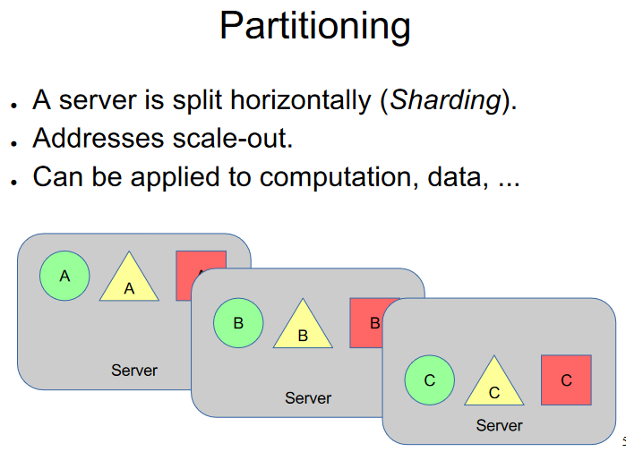

- **Horizontal Splitting (Sharding):**

  - **Definition:**
    - Partitioning, also known as sharding, involves horizontally splitting a server's data or functionality into distinct partitions.
    - Each partition is typically assigned to a different node in the distributed system.
  - **Data Partitioning:**
    - In the context of data, this means dividing a dataset into subsets that are distributed across multiple servers.
  - **Functionality Partitioning:**
    - In the context of functionality, this means dividing the application logic or services into subsets, each handled by different nodes.

- **Addresses Scale-Out:**

  - **Scale-Out:**
    - Partitioning is a strategy that addresses the need for scale-out by distributing the workload across multiple nodes.
    - Each partition can be processed independently, allowing for parallelism and improved performance.

- **Applicability to Computation and Data:**

  - **Computation:**
    - Partitioning can be applied to computation by dividing computational tasks or processes among different nodes.
  - **Data:**
    - It is commonly used in the context of data, where large datasets are partitioned to distribute the storage and processing load.

- **Benefits:**

  - **Scalability:**
    - Enables horizontal scalability, as additional nodes can be added to accommodate increased load or data volume.
    - Provides a solution to handle larger datasets or workloads.

- **Challenges:**
  - **Partitioning Strategy:**
    - Choosing an appropriate partitioning strategy is crucial, as it can impact performance and data distribution.
  - **Data Consistency:**
    - Ensuring consistency across partitions may require careful management to handle distributed transactions or eventual consistency.

In summary, partitioning in distributed systems, specifically through horizontal splitting or sharding, involves dividing a server's data or functionality to address scale-out. This strategy is applicable to both computation and data and provides benefits in terms of scalability while posing challenges related to strategy selection and data consistency.

## Service-Oriented Architecture (SOA)

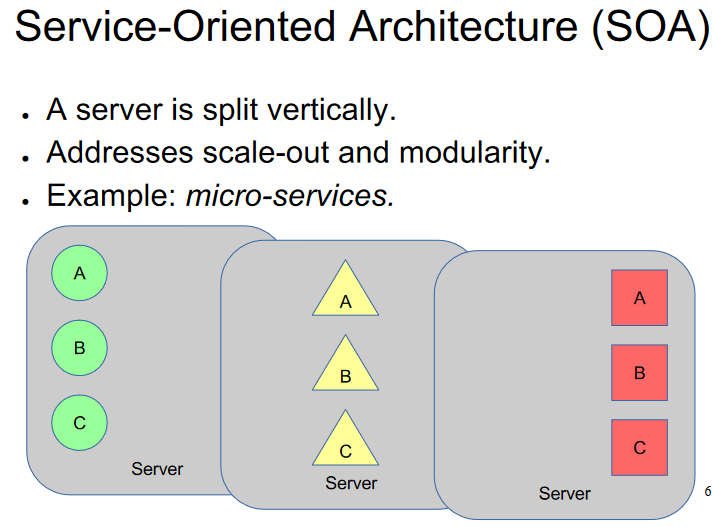

- **Vertical Splitting:**

  - **Definition:**
    - Service-Oriented Architecture (SOA) involves splitting a server vertically, where different services or functionalities are encapsulated into distinct components.
    - Each component represents a service with well-defined interfaces and functionalities.

- **Addresses Scale-Out and Modularity:**

  - **Scale-Out:**
    - SOA addresses the need for scale-out by allowing the independent scaling of individual services.
    - Each service can be deployed on separate nodes, facilitating horizontal scalability.
  - **Modularity:**
    - Encourages modularity by structuring the system as a collection of independent and loosely coupled services.
    - Each service performs a specific function, promoting ease of development, maintenance, and scalability.

- **Example: Microservices:**

  - **Microservices Architecture:**
    - Microservices, a popular implementation of SOA, involves breaking down an application into a set of small, independent services.
    - Each microservice operates as a self-contained unit with its own database and communicates with other microservices through well-defined APIs.

- **Benefits:**

  - **Scalability:**
    - Enables independent scaling of services, allowing for efficient resource utilization.
    - Supports the addition of new services without affecting existing ones.
  - **Modularity:**
    - Promotes modular development, making it easier to add, update, or replace individual services.
    - Facilitates parallel development efforts and technology diversity.

- **Challenges:**
  - **Inter-Service Communication:**
    - Managing communication and coordination between services requires careful design and consideration.
    - Implementing effective service discovery and ensuring fault tolerance in distributed systems can be challenging.

In summary, Service-Oriented Architecture (SOA), exemplified by microservices, involves vertically splitting a server into independent services. This approach addresses both scale-out and modularity, allowing for independent scaling and development of services within a distributed system.

# Monolithic vs. Microservices

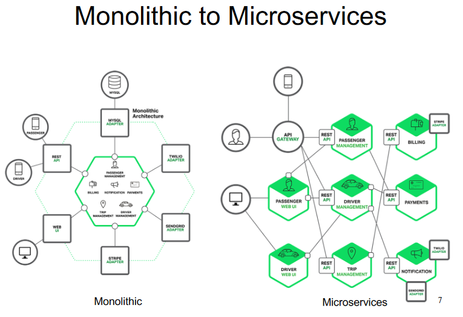

## Microservices

- **Each Service Implements Specific Functionality:**
  - Microservices architecture involves breaking down an application into small, independent services, where each service is designed to implement specific business functionalities.
  
- **Services Can Scale Independently:**
  - One of the key advantages of microservices is the ability to scale each service independently based on its specific requirements and workload.
  
- **Decomposition Challenges: How Micro is Micro?**
  - **Challenges:**
    - Decomposing an application into microservices can be challenging, and determining the appropriate size of a microservice is a subjective decision.
    - Striking the right balance is crucial to avoid creating services that are too small or too large, impacting manageability and communication overhead.

- **Consistency:**
  - **Consistency Challenges:**
    - Maintaining data consistency across microservices can be challenging due to the distributed nature of the architecture.
    - Strategies such as eventual consistency or distributed transactions may be required, introducing complexity.

- **Complex Deployment and Testing:**
  - **Deployment Challenges:**
    - Deploying and managing multiple independent services can be complex, especially in a distributed environment.
    - Adopting containerization and orchestration tools like Docker and Kubernetes can help address deployment challenges.

  - **Testing Challenges:**
    - Testing in a microservices environment requires comprehensive strategies to ensure the compatibility and functionality of each service.
    - Implementing effective testing practices, including service isolation and integration testing, is essential.

- **Benefits and Considerations:**
  - **Benefits:**
    - Enables independent development, scaling, and deployment of services.
    - Supports agility, allowing for continuous delivery and faster time-to-market.

  - **Considerations:**
    - Requires a robust infrastructure for service discovery, communication, and fault tolerance.
    - Organizational and cultural changes may be necessary to align with a microservices development and operational model.

In summary, microservices architecture involves designing small, independent services, each implementing specific functionality. While offering benefits like independent scaling and agility, it presents challenges related to decomposition, consistency, and the complexity of deployment and testing.

## Distributed Architectures

- ### Client-Server

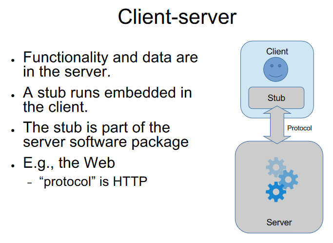

- **Functionality and Data in the Server:**
  - In a client-server architecture, the core functionality and data reside on the server.
  - Clients initiate requests to the server, which processes these requests and returns the results.

- **Stub Embedded in the Client:**
  - A client in a client-server model often runs a stub embedded in its software.
  - The stub is a client-side component that acts as a proxy for communication with the server.

- **Stub as Part of the Server Software Package:**
  - The stub, while residing on the client side, is typically part of the server software package.
  - It helps facilitate communication, making it easier for clients to interact with the server.

- **Example: The Web and HTTP:**
  - In the context of the web, the client-server architecture is exemplified by the use of HTTP (Hypertext Transfer Protocol).
  - Web browsers act as clients, making requests to web servers that host the desired content and functionality.
  
- **Communication Flow:**
  - **Client Request:**
    - The client sends requests to the server, specifying the desired operation or data.
  - **Server Processing:**
    - The server processes the request, performs the necessary operations, and may access data.
  - **Response to Client:**
    - The server sends the response back to the client, which then interprets and displays the results.

- **Benefits:**
  - **Centralized Management:**
    - Centralizing functionality and data on the server simplifies management and maintenance.
  - **Easier Updates:**
    - Updates and changes can be implemented on the server without requiring modifications to individual client installations.

- **Considerations:**
  - **Dependency on Server:**
    - The client's functionality depends on the server's availability.
    - Network latency can affect performance.

In summary, the client-server architecture involves placing functionality and data on the server, with clients utilizing a stub to communicate with the server. This architecture is exemplified by the web, where HTTP serves as the communication protocol between clients (browsers) and servers.

### Proxy Server

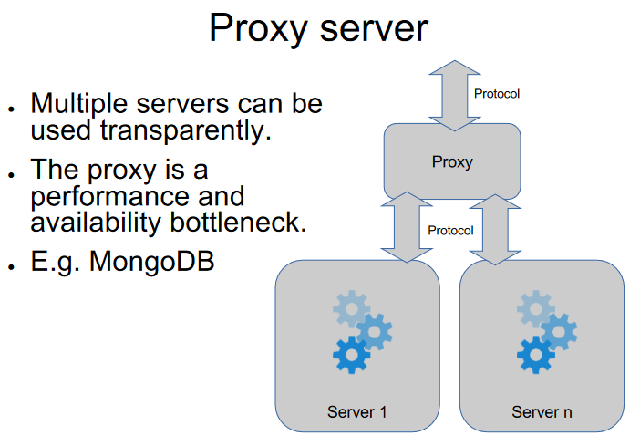

### Proxy Server

- **Multiple Servers Used Transparently:**
  - A proxy server acts as an intermediary between clients and multiple servers.
  - Clients send requests to the proxy, which then forwards these requests to the appropriate server.

- **Proxy as a Performance and Availability Bottleneck:**
  - While a proxy server allows for transparent use of multiple backend servers, it can become a performance and availability bottleneck.
  - The proxy processes all incoming requests and responses, and its performance can impact the overall system.

- **Example: MongoDB:**
  - MongoDB, a NoSQL database, can use proxy servers to distribute client requests among multiple MongoDB servers transparently.
  - The proxy helps with load balancing and can enhance fault tolerance by redirecting requests to healthy servers.

- **Communication Flow:**
  - **Client Request:**
    - Clients send requests to the proxy server, believing they are communicating directly with the backend servers.
  - **Proxy Processing:**
    - The proxy processes the request and forwards it to the appropriate backend server.
  - **Response to Client:**
    - The proxy receives the response from the server and sends it back to the client.

- **Benefits and Considerations:**
  - **Load Balancing:**
    - Proxy servers can distribute incoming requests among multiple servers, balancing the load.
  - **Fault Tolerance:**
    - Enhances fault tolerance by redirecting requests to healthy servers if some servers are unavailable.

  - **Performance Bottleneck:**
    - The proxy can become a performance bottleneck, especially if it processes a high volume of requests.
  - **Single Point of Failure:**
    - The proxy may represent a single point of failure; if it fails, clients may lose access to the backend servers.

In summary, a proxy server serves as an intermediary between clients and multiple backend servers, allowing for transparent use. While providing benefits such as load balancing and fault tolerance, it introduces considerations, including the potential for being a performance bottleneck and a single point of failure.

## Master Server

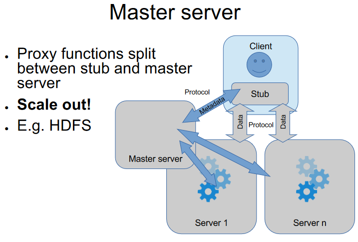

### Master Server

- **Proxy Functions Split Between Stub and Master Server:**
  - In a master-server architecture, proxy functions are split between a stub on the client side and a master server.
  - The client's stub communicates with the master server, which, in turn, manages interactions with other servers or nodes.

- **Scale Out:**
  - Master-server architectures are designed to scale out by distributing the workload across multiple servers or nodes.
  - The master server plays a central role in coordinating and managing operations.

- **Example: Hadoop Distributed File System (HDFS):**
  - HDFS, part of the Apache Hadoop framework, uses a master-server architecture.
  - The NameNode acts as the master server, handling metadata and coordinating data storage across multiple DataNodes.

- **Communication Flow:**
  - **Client Request:**
    - The client's stub communicates with the master server, sending requests for specific operations or data.
  - **Master Server Coordination:**
    - The master server coordinates the requested operation, managing interactions with other servers or nodes as needed.
  - **Response to Client:**
    - The master server sends the response back to the client, which interprets and acts on the results.

- **Benefits and Considerations:**
  - **Centralized Coordination:**
    - Centralized coordination by the master server simplifies management and control.
    - The master server can optimize resource usage and distribute tasks among nodes.
  - **Scalability:**
    - Scalability is achieved by distributing the workload across multiple servers or nodes.

  - **Single Point of Coordination:**
    - The master server may represent a single point of coordination; if it fails, it can impact the entire system.
  - **Dependency on Master Server:**
    - The performance and availability of the system depend on the master server's capabilities and responsiveness.

In summary, a master-server architecture involves splitting proxy functions between a client's stub and a central master server. This design facilitates scalability by distributing the workload across multiple servers, as seen in examples such as the Hadoop Distributed File System (HDFS).

## Server Group

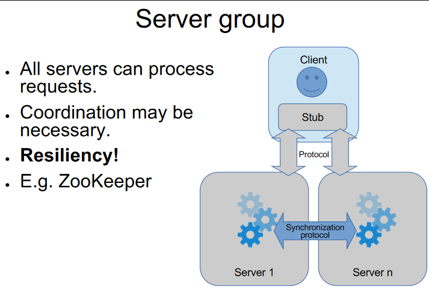

### Server Group

- **All Servers Can Process Requests:**
  - In a server group architecture, all servers within the group are capable of processing requests.
  - Clients can send requests to any server in the group, and each server is equipped to handle incoming requests.

- **Coordination May Be Necessary:**
  - While all servers can process requests independently, coordination may be necessary for certain tasks or to maintain consistency.
  - Coordination mechanisms, such as leader election or consensus algorithms, may be implemented among servers.

- **Resiliency:**
  - Server groups offer resiliency by distributing the workload across multiple servers.
  - If one server fails, clients can redirect their requests to other available servers, ensuring continuous operation.

- **Example: Apache ZooKeeper:**
  - Apache ZooKeeper is an example of a system that uses a server group architecture.
  - ZooKeeper servers work together to provide coordination services for distributed applications, using consensus algorithms to maintain consistency.

- **Communication Flow:**
  - **Client Request:**
    - Clients can send requests to any server within the group.
  - **Server Processing:**
    - The server group collectively processes the request, and coordination mechanisms are employed as needed.
  - **Response to Client:**
    - The response is sent back to the client, and clients can interact with any available server.

- **Benefits and Considerations:**
  - **Load Distribution:**
    - Workload is distributed across all servers, enabling efficient resource utilization.
    - Offers improved scalability by adding more servers to the group.

  - **Resiliency and Fault Tolerance:**
    - Resiliency is achieved through redundancy; if one server fails, others can continue processing requests.
    - Fault tolerance is enhanced by having multiple independent servers.

  - **Coordination Overhead:**
    - Coordination mechanisms may introduce overhead, especially for tasks requiring consensus among servers.
    - Efficient coordination strategies are crucial to avoid performance bottlenecks.

In summary, a server group architecture involves multiple servers capable of processing requests independently. While offering benefits such as load distribution and resiliency, coordination mechanisms may be necessary, and efficient strategies are crucial to manage coordination overhead, as seen in examples like Apache ZooKeeper.

## Bus

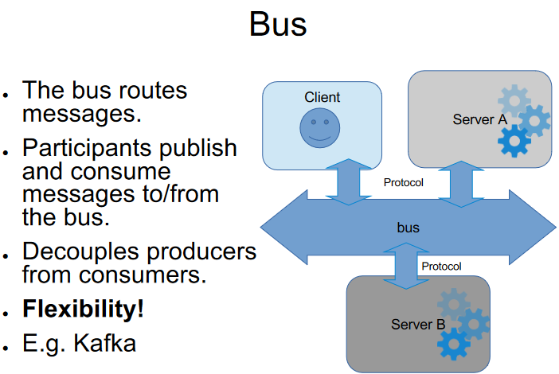

### Bus Architecture

- **The Bus Routes Messages:**
  - In a bus architecture, a central message bus is responsible for routing messages between participants in the system.
  - Messages are published to the bus by producers and consumed by consumers subscribed to specific topics or channels.

- **Participants Publish and Consume Messages:**
  - Participants in the system, both producers and consumers, interact with the message bus.
  - Producers publish messages to the bus, and consumers subscribe to specific topics or channels to receive relevant messages.

- **Decouples Producers from Consumers:**
  - One of the key features of a bus architecture is that it decouples producers from consumers.
  - Producers and consumers do not need to be aware of each other; they communicate through the central message bus.

- **Flexibility:**
  - Bus architectures offer flexibility in terms of communication patterns and system scalability.
  - Participants can dynamically join or leave the system, and the bus facilitates message distribution accordingly.

- **Example: Apache Kafka:**
  - Apache Kafka is an example of a system that implements a bus architecture.
  - Kafka serves as a distributed streaming platform where producers publish records to topics, and consumers subscribe to these topics to process the records.

- **Communication Flow:**
  - **Publishing:**
    - Producers publish messages to specific topics on the bus.
  - **Routing:**
    - The message bus routes published messages to the relevant topics.
  - **Consuming:**
    - Consumers subscribe to topics of interest and receive messages from the bus.

- **Benefits and Considerations:**
  - **Decoupling:**
    - Decouples producers and consumers, allowing for flexible and scalable communication.
  - **Scalability:**
    - Scalable and dynamic, supporting the addition or removal of participants without direct dependencies.

  - **Message Ordering:**
    - Ensuring the ordering of messages may require careful consideration, especially in distributed systems.
  - **Message Durability:**
    - Strategies for message durability may be necessary to handle potential message loss or system failures.

In summary, a bus architecture involves a central message bus that routes messages between participants, decoupling producers from consumers. This design, exemplified by Apache Kafka, offers flexibility and scalability, but considerations such as message ordering and durability need attention in distributed systems.

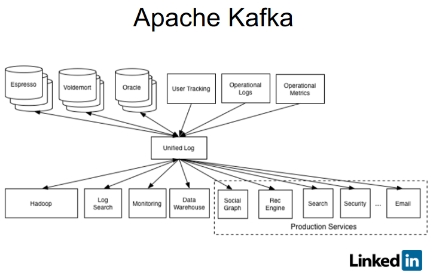

## Multi-Tier

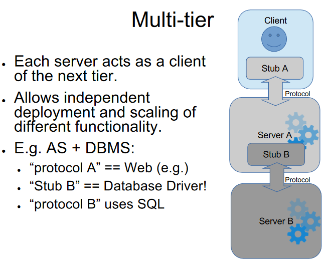

### Multi-Tier Architecture

- **Each Server Acts as a Client of the Next Tier:**
  - In a multi-tier architecture, the system is organized into multiple layers or tiers, where each server in a tier acts as a client of the next tier.
  - Communication typically flows from the presentation tier to the application tier, and then to the data tier.

- **Allows Independent Deployment and Scaling of Different Functionality:**
  - Multi-tier architectures allow for independent deployment and scaling of different functionality within each tier.
  - Presentation, application, and data tiers can be developed, deployed, and scaled independently, providing flexibility and maintainability.

- **Example: Application Server (AS) + Database Management System (DBMS):**
  - An example of a multi-tier architecture is the combination of an Application Server (AS) and a Database Management System (DBMS).
  - The presentation tier interacts with the AS, which in turn communicates with the DBMS in the data tier.

- **Communication Protocols:**
  - **"Protocol A" (e.g., Web):**
    - The communication protocol used in the presentation tier, such as HTTP for web-based applications.
  - **"Protocol B" (uses SQL):**
    - The communication protocol between the application tier and the data tier, often using SQL for database queries.

- **Components:**
  - **"Stub B" (Database Driver):**
    - In the application tier, a component like a database driver (stub) facilitates communication with the data tier.
    - It converts higher-level queries or commands into the specific language understood by the DBMS.

- **Communication Flow:**
  - **Presentation Tier:**
    - The presentation tier communicates with the application tier using "Protocol A" (e.g., HTTP).
  - **Application Tier:**
    - The application tier, represented by the AS, processes requests and communicates with the data tier using "Protocol B" (e.g., SQL).
  - **Data Tier:**
    - The data tier, represented by the DBMS, manages the storage and retrieval of data.

- **Benefits and Considerations:**
  - **Modularity and Scalability:**
    - Modularity allows for independent development and scaling of each tier.
    - Enables scalability by adding more servers to the respective tiers.

  - **Complexity:**
    - The multi-tier architecture introduces additional complexity, especially in managing communication between tiers.
  - **Potential Bottlenecks:**
    - Careful design is required to avoid potential bottlenecks, especially in the communication between tiers.

In summary, a multi-tier architecture organizes the system into layers, allowing each server to act as a client of the next tier. This design facilitates independent development and scaling of different functionality within each tier, providing flexibility and modularity.

## State in Multi-Tier

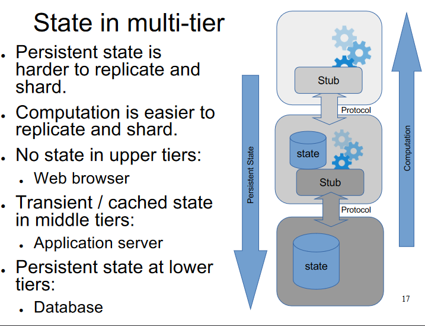

### State in Multi-Tier Architecture

- **Persistent State is Harder to Replicate and Shard:**
  - Managing persistent state, such as long-term data storage, is challenging to replicate and shard across multiple servers or tiers.
  - Ensuring consistency and durability becomes more complex when dealing with persistent state.

- **Computation is Easier to Replicate and Shard:**
  - Computation, representing the processing logic and application functionality, is generally easier to replicate and shard.
  - Stateless computations can be distributed across multiple servers without concerns about persistent data storage.

- **No State in Upper Tiers:**
  - Upper tiers, such as the presentation tier (e.g., web browser), typically avoid maintaining state.
  - Statelessness in upper tiers simplifies client interactions and reduces the need for persistent connections.

- **Transient / Cached State in Middle Tiers:**
  - Middle tiers, such as the application server, may handle transient or cached state.
  - Transient state represents short-lived information needed for processing requests, enhancing performance by avoiding repeated data retrieval.

- **Persistent State at Lower Tiers:**
  - Lower tiers, specifically the data tier (e.g., database), are responsible for managing persistent state.
  - Databases store long-term data, ensuring durability and consistency, but this introduces challenges related to replication and sharding.

- **Communication Flow with State:**
  - **Upper Tier (Web Browser):**
    - Stateless interactions with the web browser, focusing on displaying information and handling user input.
  - **Middle Tier (Application Server):**
    - Manages transient or cached state to optimize processing.
  - **Lower Tier (Database):**
    - Manages persistent state, ensuring data durability and consistency.

- **Benefits and Considerations:**
  - **Stateless Upper Tiers:**
    - Stateless upper tiers simplify client interactions and reduce the complexity of managing state on the client side.
  - **Performance Optimization with Transient State:**
    - Transient or cached state in middle tiers optimizes performance by avoiding redundant data retrieval.
  
  - **Challenges of Persistent State:**
    - Managing persistent state in lower tiers introduces challenges related to replication, sharding, consistency, and durability.
  - **Balancing State and Performance:**
    - Striking a balance between maintaining necessary state for functionality and optimizing performance is crucial.

In summary, state in a multi-tier architecture varies across tiers. Upper tiers are often stateless, middle tiers may handle transient or cached state, and lower tiers, particularly the data tier, manage persistent state. Balancing the requirements of stateful functionality and performance optimization is essential.
