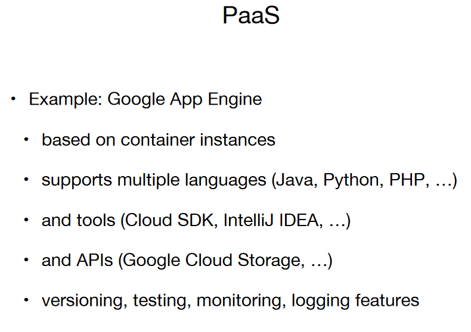

# **Cloud Computing**
### **Cloud Services Abstractions**

**Cloud services are divided into 3 main abstractions:**

1. **Infrastructure-as-a-Service (IaaS):**
   - **Definition:** IaaS provides virtualized computing resources over the internet. It offers fundamental building blocks like virtual machines, storage, and networking.
   - **Use Case:** Users have control over the operating system, applications, and configurations, making it suitable for tasks such as hosting applications, development environments, or running virtual servers.

2. **Platform-as-a-Service (PaaS):**
   - **Definition:** PaaS is a cloud computing service that provides a platform allowing customers to develop, run, and manage applications without dealing with the complexities of infrastructure. It abstracts away the underlying infrastructure details.
   - **Use Case:** Ideal for developers as it enables them to focus on writing code without worrying about the underlying infrastructure. PaaS offerings often include application hosting, database management, and development frameworks.

3. **Software-as-a-Service (SaaS):**
   - **Definition:** SaaS delivers software applications over the internet on a subscription basis. Users can access the software through a web browser without the need for installation or maintenance.
   - **Use Case:** Commonly used for business applications, collaboration tools, and productivity software. Examples include email services, customer relationship management (CRM) software, and office productivity suit

# **Infrastucture-as-a-Service (IaaS)**

**Overview:**
- IaaS provides virtualized hardware resources such as computing, storage, and networking, allowing users to build and manage their infrastructure in a flexible and scalable manner.

**Key Characteristics:**

- **Global Data Centers:**
  - IaaS providers operate data centers globally, distributed across regions such as Asia, Europe, and America.
  - **Purpose:** These data centers serve as the foundation for delivering virtualized computing resources to users worldwide.

- **Scale of Servers:**
  - Each data center is equipped with a substantial number of servers, typically around 80,000 servers or more.
  - **Purpose:** The large-scale infrastructure allows IaaS providers to meet the demands of diverse users and applications.

- **Major Players:**
  - The top players in the IaaS market include Google, Amazon, and Microsoft, among others.
  - **Significance:** These major providers offer a wide range of services, high reliability, and extensive global infrastructure.

**Key Features:**

- **Virtualized Hardware Resources:**
  - IaaS provides virtualized computing, storage, and networking resources that can be provisioned and managed over the internet.
  - **Flexibility:** Users have the flexibility to deploy and scale virtualized infrastructure components based on their specific requirements.

- **On-Demand Allocation:**
  - Resources in IaaS are allocated on-demand, allowing users to scale up or down as needed.
  - **Scalability:** This on-demand model promotes scalability and cost efficiency, as users only pay for the resources they consume.

- **Pay-per-Use Model:**
  - IaaS operates on a pay-per-use or pay-as-you-go pricing model, where users are billed based on their actual resource consumption.
  - **Cost Efficiency:** Users can avoid upfront capital expenses and only pay for the resources utilized during a specific period.

**Examples of IaaS Services:**

1. **Amazon EC2 (Elastic Compute Cloud):**
   - *Description:* Amazon EC2 provides resizable compute capacity in the cloud. Users can launch virtual servers, known as instances, and scale computing resources on-demand.
   - *Use Case:* Computing workloads, application hosting, and development environments.

2. **Google Compute Engine:**
   - *Description:* Google Compute Engine offers virtual machines (VMs) with flexibility and control over computing resources. Users can deploy and manage VMs in Google's infrastructure.
   - *Use Case:* High-performance computing, data analytics, and general-purpose computing.

3. **Amazon S3 (Simple Storage Service):**
   - *Description:* Amazon S3 provides scalable and durable object storage in the cloud. Users can store and retrieve any amount of data with high availability.
   - *Use Case:* Data storage, backup and recovery, content distribution.

**Considerations:**

- **Service Offerings:**
  - IaaS providers offer a variety of services beyond basic computing resources, including managed services, storage solutions, and networking capabilities.

- **Vendor Lock-in:**
  - Users should be mindful of potential vendor lock-in when choosing an IaaS provider. Consideration should be given to portability and interoperability.

- **Security and Compliance:**
  - Security and compliance standards vary among providers. Organizations need to assess and ensure that the chosen IaaS provider meets their specific security and regulatory requirements.

**Benefits:**

- **Scalability:**
  - IaaS allows organizations to scale their infrastructure up or down based on demand, promoting flexibility and cost efficiency.

- **Reduced Capital Expenses:**
  - Organizations can avoid significant upfront capital expenses by leveraging IaaS and paying for resources on a pay-as-you-go model.

- **Global Presence:**
  - The global presence of data centers ensures that users can deploy applications closer to their target audience, improving performance and user experience.

In summary, IaaS provides a scalable and flexible infrastructure foundation with global data centers, extensive server resources, and key players like Google, Amazon, and Microsoft. Users can leverage these services for diverse applications, benefitting from the competitive landscape and the ability to scale on-demand.

## **OpenStack**

**Overview:**
- OpenStack is open-source software designed for creating both private and public clouds. It serves as a comprehensive cloud computing platform, enabling the management of large pools of compute, storage, and networking resources across data centers.

**Key Characteristics:**

- **Open Source Nature:**
  - OpenStack is developed and maintained as open-source software, fostering collaboration and contributions from a diverse community of developers.
  - **Community Involvement:** The open-source model encourages transparency, innovation, and community-driven enhancements.

- **Resource Control:**
  - OpenStack allows for the control and orchestration of significant pools of computing, storage, and networking resources.
  - **Scalability:** Users can scale resources based on demand, facilitating the efficient allocation and management of infrastructure.

- **Datacenter-wide Management:**
  - OpenStack is designed to extend its influence throughout a datacenter, providing centralized management of resources across various hardware and infrastructure components.
  - **Efficiency:** Centralized management enhances efficiency and simplifies the administration of diverse resources.

**Management Interfaces:**

- **Dashboard (Horizon):**
  - OpenStack includes a web-based dashboard called Horizon, providing a graphical user interface (GUI) for managing and monitoring cloud resources.
  - **User-Friendly:** The dashboard simplifies the user experience, allowing users to interact with OpenStack services without the need for extensive command-line knowledge.

- **API (Application Programming Interface):**
  - OpenStack can be managed programmatically through its API. The API enables automation, integration, and customization of cloud infrastructure.
  - **Flexibility:** Users can leverage the API to integrate OpenStack with other tools, systems, and applications.

**Use Cases:**

- **Private Clouds:**
  - Organizations can deploy OpenStack to create and manage private clouds, meeting specific business requirements and ensuring control over sensitive data.

- **Public Clouds:**
  - Service providers can use OpenStack to deliver public cloud services, offering scalability and resource sharing to a broader user base.

**Benefits:**

- **Cost-Effective Cloud Solutions:**
  - OpenStack's open-source nature and flexibility contribute to cost-effective cloud solutions, particularly for organizations seeking alternatives to proprietary cloud platforms.

- **Scalability and Resource Efficiency:**
  - OpenStack's ability to control large pools of resources allows for scalability and resource efficiency, ensuring optimal use of infrastructure.

- **Customization and Integration:**
  - The availability of APIs enables customization and integration with other tools and systems, offering flexibility in building tailored cloud environments.

**Challenges:**

- **Complexity:**
  - Implementing and managing OpenStack can be complex, requiring expertise in cloud architecture and administration.

- **Resource Intensive:**
  - OpenStack may demand substantial computing resources, and organizations need to consider the hardware requirements for deployment.

In summary, OpenStack is a powerful open-source platform for cloud computing, providing resource control, datacenter-wide management, and flexibility through its dashboard and API. It is well-suited for creating both private and public clouds, offering cost-effective and scalable solutions.

### OpenStack Cinder

**Overview:**
- OpenStack Cinder is a component within the OpenStack cloud computing platform specifically designed for managing block storage. It virtualizes the management of block storage devices, offering a self-service API for end users to request and consume storage resources without needing detailed knowledge of the underlying infrastructure.

**Key Characteristics:**

- **Block Storage Management:**
  - Cinder focuses on the management of block storage, providing users with the ability to attach and detach storage volumes to and from virtual machines.
  - **Use Case:** Suitable for scenarios where applications require scalable and persistent block-level storage.

- **Virtualization of Storage Management:**
  - Cinder virtualizes the management of block storage devices, abstracting the complexity of storage infrastructure and providing a standardized interface for users.
  - **Simplification:** Users can interact with storage resources without needing to understand the specific details of where the storage is physically deployed or the type of device used.

- **Self-Service API:**
  - Cinder offers a self-service API that allows end users to request and consume storage resources on-demand.
  - **User Empowerment:** End users gain the ability to provision and manage storage resources independently, enhancing agility and reducing administrative overhead.

**User Workflow:**

1. **Requesting Storage Resources:**
   - Users utilize the Cinder API to request the creation of storage volumes based on their application requirements.

2. **Provisioning and Attachment:**
   - Cinder orchestrates the provisioning of storage volumes and attaches them to the specified virtual machines or instances.

3. **Consuming Resources:**
   - End users can consume the attached storage volumes within their virtual machines, using them as scalable and persistent block storage.

4. **Detachment and De-provisioning:**
   - When no longer needed, users can detach storage volumes, and Cinder facilitates the de-provisioning of resources, reclaiming storage capacity.

**Benefits:**

- **Abstraction of Complexity:**
  - Cinder abstracts the complexity of managing block storage devices, providing users with a simplified and standardized interface.

- **Self-Service Provisioning:**
  - The self-service API empowers end users to independently provision and manage storage resources, reducing dependency on administrative teams.

- **On-Demand Scalability:**
  - Users can dynamically scale their storage resources based on changing application needs, ensuring flexibility and responsiveness.

**Considerations:**

- **Compatibility:**
  - Organizations should ensure compatibility with their virtualization platform and hypervisors when implementing Cinder.

- **Integration with Other OpenStack Services:**
  - Cinder is often integrated with other OpenStack services such as Nova (compute) and Horizon (dashboard) to provide a comprehensive cloud environment.

**Use Cases:**

- **Database Storage:**
  - Cinder is suitable for managing storage volumes used by databases, ensuring scalable and persistent block storage.

- **Application Data Storage:**
  - Applications that require scalable and flexible block-level storage can benefit from Cinder for on-demand resource provisioning.

In summary, OpenStack Cinder serves as a critical component for managing block storage within the OpenStack cloud platform. Its virtualization capabilities, self-service API, and abstraction of complexity make it a valuable tool for organizations seeking scalable and user-friendly block storage solutions.

### OpenStack Swift

**Overview:**
- OpenStack Swift is a highly available, distributed, and eventually consistent object/blob store within the OpenStack cloud computing platform. It is designed for the storage of unstructured data, such as virtual machine images and videos, that can grow without bounds.

**Key Characteristics:**

- **Highly Available:**
  - Swift is built to provide high availability, ensuring that data remains accessible even in the face of hardware failures or network issues.
  - **Reliability:** The system is architected to minimize downtime and maintain data integrity.

- **Distributed Architecture:**
  - Swift operates on a distributed architecture, distributing data across multiple nodes and storage devices.
  - **Scalability:** The distributed nature allows for seamless scalability as the amount of stored data grows.

- **Eventually Consistent:**
  - Swift follows an eventually consistent model, meaning that over time, all replicas of data across the system will converge to a consistent state.
  - **Scalability and Performance:** Eventual consistency enhances scalability and performance by allowing for more flexibility in distributing and replicating data.

**Use Cases:**

- **Unstructured Data Storage:**
  - Swift is ideal for storing unstructured data, including large files such as VM images, videos, and other content that can scale without predefined bounds.

- **Data Archives:**
  - Organizations can use Swift for archiving data, taking advantage of its scalability and high availability for long-term storage.

**User Workflow:**

1. **Uploading Data:**
   - Users can upload unstructured data, such as images or videos, to Swift using the provided API or compatible tools.

2. **Distribution and Replication:**
   - Swift automatically distributes and replicates the data across multiple nodes within the Swift cluster to ensure high availability and fault tolerance.

3. **Accessing Data:**
   - Users can access their stored data from any node within the Swift cluster, providing seamless and distributed access to the stored objects.

4. **Scaling Storage:**
   - As data storage needs grow, Swift scales horizontally by adding more nodes to the cluster, ensuring continued scalability and efficient data management.

**Benefits:**

- **Scalability Without Bounds:**
  - Swift is designed to handle the storage of unstructured data that can grow without predefined limits, making it suitable for large-scale and ever-expanding datasets.

- **High Availability:**
  - The distributed and redundant architecture of Swift ensures high availability, reducing the risk of data loss or unavailability.

- **Flexibility for Unstructured Data:**
  - Swift provides a flexible solution for storing various types of unstructured data, enabling organizations to manage diverse content efficiently.

**Considerations:**

- **Data Consistency Model:**
  - Organizations should understand the eventually consistent nature of Swift and ensure it aligns with their application requirements.

- **Integration and Compatibility:**
  - Swift may need integration with other OpenStack services or compatible tools for seamless data management and access.

In summary, OpenStack Swift is a robust and scalable solution for storing unstructured data, offering high availability and eventual consistency. Its distributed architecture makes it well-suited for organizations dealing with large and growing datasets that require reliable and flexible storage solutions.

### OpenStack Neutron

**Overview:**
- OpenStack Neutron is a component within the OpenStack cloud computing platform that operates as a Software-Defined Networking (SDN) solution. It is specifically focused on delivering Networking-as-a-Service (NaaS) in virtualized compute environments.

**Key Characteristics:**

- **Software-Defined Networking (SDN):**
  - Neutron leverages the principles of Software-Defined Networking, providing a programmable and centralized approach to network management.
  - **Flexibility:** SDN allows for dynamic and automated control over network infrastructure.

- **Networking-as-a-Service (NaaS):**
  - Neutron is designed to deliver Networking-as-a-Service, allowing users to provision and manage network resources as they would with other cloud services.
  - **On-Demand Networking:** Users can dynamically allocate and configure networking resources based on application needs.

- **Abstraction of Network Topology:**
  - Neutron abstracts the underlying network topology, providing a higher-level view of the network architecture.
  - **Simplified Management:** Abstraction simplifies network management and allows users to focus on the logical organization of their network.

**User Workflow:**

1. **Network Resource Provisioning:**
   - Users leverage Neutron to provision various network resources, such as virtual networks, subnets, routers, and security groups.

2. **Connecting Instances:**
   - Neutron facilitates the connection of virtual instances (VMs) to the provisioned network resources, ensuring seamless communication between instances.

3. **Dynamic Configuration:**
   - Users can dynamically configure and update network settings, adjusting parameters such as IP addressing, routing, and security policies.

4. **Network Automation:**
   - Neutron supports automation through APIs and integration with orchestration tools, enabling the dynamic creation and management of network resources.

**Benefits:**

- **Flexible Network Configuration:**
  - Neutron enables flexible and dynamic configuration of network resources, accommodating changing requirements and application needs.

- **Isolation and Security Groups:**
  - Users can create isolated network environments and define security groups, ensuring secure communication and data protection.

- **Integration with SDN Controllers:**
  - Neutron can integrate with external SDN controllers, offering extended capabilities and flexibility in network management.

**Considerations:**

- **Understanding SDN Concepts:**
  - Organizations should have a solid understanding of SDN concepts and principles to effectively utilize Neutron's capabilities.

- **Integration with Other OpenStack Services:**
  - Neutron often integrates with other OpenStack services, such as Nova (compute) and Cinder (block storage), to provide comprehensive cloud networking.

**Use Cases:**

- **Multi-Tenant Environments:**
  - Neutron is well-suited for multi-tenant environments, allowing the creation of isolated and dedicated network spaces for different users or projects.

- **Scalable Network Infrastructure:**
  - Organizations with dynamic or growing workloads benefit from Neutron's ability to scale network infrastructure based on demand.

In summary, OpenStack Neutron serves as a Software-Defined Networking solution within the OpenStack cloud platform, focusing on delivering Networking-as-a-Service. It abstracts network topology, provides flexible configuration, and supports automation, making it a key component for managing virtualized network environments in cloud computing.

# From IaaS to PaaS

**Transition Overview:**
- The transition from Infrastructure-as-a-Service (IaaS) to Platform-as-a-Service (PaaS) represents a shift in the level of abstraction and management focus in cloud computing.

**Key Characteristics:**

- **User Focus on Functionality:**
  - In PaaS, users can primarily focus on developing and deploying application functionality rather than managing underlying infrastructure.
  - **Simplified Development:** Developers can concentrate on coding and application logic without the need to delve into resource requirements.

- **Transparency of Resources:**
  - Actual resources, such as virtual machines and networking, become transparent to the user. The focus shifts from managing infrastructure to managing the deployment item (application).
  - **Abstraction of Complexity:** Users are shielded from the complexities of underlying hardware and infrastructure management.

- **Encapsulation of Development Environment:**
  - PaaS offers encapsulation of a development environment abstraction, providing a consistent platform for developing, deploying, and running applications.
  - **Consistency Across Lifecycle:** The development environment encapsulation ensures consistency from development to deployment, reducing compatibility issues.

- **Programming Environment Interface:**
  - The interface in PaaS is a programming environment, equipped with APIs that allow seamless interaction with both IaaS and SaaS services.
  - **Automation and Integration:** Developers can leverage APIs to automate tasks, integrate with IaaS services, and access additional services offered by the underlying cloud infrastructure.

**Benefits:**

- **Development Efficiency:**
  - PaaS accelerates development by eliminating the need for developers to manage infrastructure, allowing them to focus solely on coding and application logic.

- **Consistent Deployment Environment:**
  - The encapsulation of development environments ensures consistency, reducing deployment-related issues and improving application stability.

- **Scalability and Resource Management:**
  - PaaS platforms often provide built-in scalability features, allowing applications to scale easily without requiring manual intervention in resource provisioning.

**Considerations:**

- **Learning Curve:**
  - Developers may need to familiarize themselves with the specific PaaS platform and its tools, potentially introducing a learning curve.

- **Vendor Lock-in:**
  - Depending on the chosen PaaS provider, there may be considerations around vendor lock-in. Users should assess the portability and interoperability of their applications.

**Use Cases:**

- **Web Application Development:**
  - PaaS is well-suited for web application development, where developers can focus on building and deploying application logic without dealing with infrastructure details.

- **Microservices Architecture:**
  - Organizations adopting a microservices architecture can benefit from PaaS, as it provides a streamlined platform for developing and deploying individual services.

**Summary:**
The transition from IaaS to PaaS empowers users to shift their focus from managing infrastructure to developing and deploying application functionality. PaaS offers an encapsulated development environment, abstracting resource details and providing a consistent platform for efficient application development and deployment. The programming environment interface, coupled with APIs, enables seamless interaction with IaaS and SaaS services, fostering automation and integration.

# From PaaS to SaaS

**Transition Overview:**
- The transition from Platform-as-a-Service (PaaS) to Software-as-a-Service (SaaS) represents a further abstraction, moving from providing a development platform to offering full applications or generic software as a service.

**Key Characteristics:**

- **Full Applications or Generic Software:**
  - SaaS delivers fully developed applications or generic software as a service, providing users with a ready-to-use solution without the need for development or customization.
  - **User Accessibility:** Users can access the software directly as web services or through a web browser.

- **Web-Based Access:**
  - SaaS applications are typically accessible through web services or web browsers, offering a user-friendly and platform-independent experience.
  - **Ease of Accessibility:** Users can access the software from any device with internet connectivity.

- **Managed Software Components:**
  - SaaS involves managed software components that export their traditional APIs, allowing users to interact with the software through standard interfaces.
  - **Integration Possibilities:** Traditional APIs facilitate integration with other systems and services.

- **Examples - Database Management Systems:**
  - Database management systems offered as SaaS are examples where users can utilize database services without the need to deploy or manage the underlying infrastructure.
  - **Minimal Configuration:** Users can use the database as they would with traditional database systems but with minimal configuration needed and remote access.

- **No Deployment Item:**
  - Unlike PaaS, there is no deployment item in SaaS. Users do not need to concern themselves with the underlying infrastructure or development environment.
  - **Instant Accessibility:** Users can instantly access and use the software without the need for setup or deployment tasks.

- **Well-Known Instances:**
  - Examples like SalesForce.com and Google Apps (e.g., Gmail) exemplify SaaS offerings where complete applications are provided as services.

**Benefits:**

- **Instant Usability:**
  - SaaS provides instant usability, allowing users to access and utilize the software without the need for installation or configuration.

- **Simplified Maintenance:**
  - Maintenance tasks, including updates and patches, are typically managed by the SaaS provider, relieving users of software maintenance responsibilities.

- **Scalable and Cost-Effective:**
  - SaaS solutions are often scalable, and users can benefit from a cost-effective subscription model without the upfront costs associated with traditional software.

**Considerations:**

- **Customization Limitations:**
  - SaaS solutions may have limitations in terms of customization, and users may need to adapt to the features provided by the service.

- **Data Security and Compliance:**
  - Organizations should consider data security and compliance when opting for SaaS solutions, especially when sensitive data is involved.

**Use Cases:**

- **Collaboration Tools:**
  - SaaS offerings like Google Apps provide collaboration tools, including email, document editing, and communication, without the need for installation.

- **Customer Relationship Management (CRM):**
  - SalesForce.com is an example of SaaS used for customer relationship management, offering a comprehensive solution without the need for in-house development or infrastructure management.

**Summary:**
The transition from PaaS to SaaS represents a shift from providing a development platform to delivering fully developed applications or generic software as a service. SaaS offers instant usability, simplified maintenance, and scalability, making it a convenient and cost-effective solution for users who prioritize ready-to-use software without the need for development or infrastructure management.

# Summary Advantages

## Convenience

**From IaaS to PaaS:**
- **Avoiding Upfront Costs:**
  - Users transitioning from Infrastructure-as-a-Service (IaaS) to Platform-as-a-Service (PaaS) benefit from avoiding upfront costs associated with infrastructure management and hardware procurement.
  - **Cost-Efficiency:** With PaaS, the burden of managing and maintaining infrastructure is shifted to the platform provider, offering a cost-effective solution.

- **Legacy Application Deployment:**
  - Users can "easily" deploy legacy applications on PaaS without dealing with the complexities of infrastructure provisioning. PaaS abstracts the underlying infrastructure, streamlining the deployment process.
  - **Simplified Migration:** The transition allows for a smoother migration of legacy applications to a more modern and scalable platform.

- **Focus on Application Development:**
  - PaaS enables users to shift their focus from managing infrastructure to application development itself. Development, deployment, debugging, and benchmarking tools are already in place, streamlining the entire development lifecycle.
  - **Development Efficiency:** Developers can concentrate on coding and improving application functionality rather than managing the intricacies of the development environment.

**From PaaS to SaaS:**
- **Leveraging Existing Components:**
  - Transitioning from Platform-as-a-Service (PaaS) to Software-as-a-Service (SaaS) allows users to leverage existing components such as databases, web/application servers, and other managed software services.
  - **Instant Accessibility:** SaaS provides ready-to-use components, eliminating the need for users to deploy, configure, or manage these components independently.

- **Convenience of Existing Infrastructure:**
  - Users benefit from the convenience of utilizing existing infrastructure components without the need for extensive customization or management.
  - **Simplified Integration:** SaaS solutions often offer seamless integration with commonly used components, reducing the complexity of software composition.

**Overall Convenience:**
- **Cost Savings:**
  - Across the transition, users experience cost savings by avoiding upfront infrastructure costs (IaaS), reducing development-related overhead (PaaS), and leveraging existing components without the need for independent management (SaaS).

- **Streamlined Workflows:**
  - The convenience extends to streamlined workflows throughout the entire development and deployment process. Users can achieve more with less effort, focusing on core tasks rather than administrative complexities.

- **Rapid Deployment and Scaling:**
  - The transition from IaaS to PaaS to SaaS allows for rapid deployment and scaling of applications. Users can easily adapt to changing requirements without the delays associated with traditional infrastructure management.

**Considerations:**
- Users should consider factors such as customization needs, data security, and compliance requirements when opting for convenience-driven transitions across cloud service models.

## Speed

**From IaaS to PaaS:**
- **Installed and Configured Infrastructure:**
  - Transitioning from Infrastructure-as-a-Service (IaaS) to Platform-as-a-Service (PaaS) benefits from the speed of having the infrastructure already installed and configured.
  - **Reduced Setup Time:** Users can significantly reduce the time required for setting up and configuring the underlying infrastructure, allowing for a faster development and deployment process.

- **Development Framework in Place:**
  - With PaaS, a development framework is already installed and configured, providing a ready-to-use environment for developers.
  - **Accelerated Development:** Developers can start coding and building applications immediately, leveraging the pre-configured development tools and frameworks.

**From PaaS to SaaS:**
- **Quick Integration of Software Solutions:**
  - Transitioning from Platform-as-a-Service (PaaS) to Software-as-a-Service (SaaS) allows for the quick integration of different cloud software solutions.
  - **Out-of-the-Box Integration:** SaaS solutions often provide out-of-the-box integration capabilities, enabling users to seamlessly combine and utilize various software components without extensive configuration.

- **Ready-to-Use Components:**
  - SaaS offerings come with ready-to-use components, eliminating the need for users to install, configure, or integrate different software solutions independently.
  - **Instant Accessibility:** Users can rapidly integrate and utilize SaaS components, reducing the time between software selection and actual implementation.

**Overall Speed:**
- **Accelerated Development Lifecycle:**
  - The transition from IaaS to PaaS to SaaS contributes to an accelerated development lifecycle. Infrastructure setup, development framework availability, and software integration are already streamlined, allowing for faster project timelines.

- **Reduced Time-to-Market:**
  - The speed gained from pre-configured infrastructure (IaaS), development frameworks (PaaS), and integrated software solutions (SaaS) collectively contribute to a reduced time-to-market for applications and services.

**Considerations:**
- While speed is a significant advantage, users should balance it with considerations such as customization needs, security, and compliance requirements to ensure a holistic and well-optimized cloud deployment strategy.

## Elasticity

**From IaaS:**
- **Illusion of Virtually Infinite Resources:**
  - Transitioning from Infrastructure-as-a-Service (IaaS) involves the illusion of virtually infinite resources, allowing users to scale up or down based on demand.
  - **Flexible Resource Allocation:** IaaS provides the flexibility to increase and decrease computational power, storage space, and other resources dynamically to meet changing application requirements.

- **Manual or Third-Party Tools:**
  - Elasticity in IaaS can be managed manually, where users adjust resource allocations based on demand. Alternatively, third-party tools can automate the scaling process.
  - **Responsive to Demand:** The ability to manually or automatically adjust resources ensures a responsive infrastructure that aligns with varying workloads.

**To PaaS and SaaS:**
- **No Manual Management of Elasticity:**
  - Transitioning to Platform-as-a-Service (PaaS) and Software-as-a-Service (SaaS) eliminates the need for manual management of elasticity.
  - **Automated Scaling:**
    - PaaS and SaaS platforms often come with built-in automated scaling features. The elasticity of resources is managed seamlessly by the platform, responding to application demands without manual intervention.

**Definition of Elasticity:**
- **Capacity to Scale Up or Down:**
  - Elasticity refers to the capacity to scale up or down resources, such as computational power, storage, and network, according to the requirements of applications.

**Benefits:**
- **Responsive to Dynamic Workloads:**
  - Elasticity ensures that resources can be scaled dynamically in response to changing workloads. This responsiveness contributes to optimal resource utilization and performance.

- **Cost Optimization:**
  - Automated elasticity in PaaS and SaaS platforms supports cost optimization by scaling resources based on actual demand, preventing over-provisioning and unnecessary costs.

**Considerations:**
- While elasticity offers significant benefits, users should consider factors such as cost implications, performance monitoring, and the potential impact on data storage and network bandwidth during scaling operations.

# Summary Disadvantages

## Loss of Control

**From IaaS:**
- **No Control Over Specific Hardware and Virtualization Software:**
  - Transitioning from Infrastructure-as-a-Service (IaaS) involves a loss of control as users have no direct control over specific hardware and virtualization software.
  - **Limited Fine-Tuning and Optimization:**
    - Users lack the ability to fine-tune and optimize the underlying infrastructure according to specific preferences or requirements.

**To PaaS:**
- **No Control Over Specific Hardware and PaaS Platform:**
  - Moving from Platform-as-a-Service (PaaS) results in a loss of control over specific hardware, and users have limited control over the PaaS platform itself.
  - **Reduced Management and Fine-Tuning:**
    - Users are constrained to the tools provided by the PaaS platform for management, fine-tuning, and monitoring, limiting customization options.

**To SaaS:**
- **Third-Party Cloud Applications:**
  - Transitioning to Software-as-a-Service (SaaS) involves using third-party cloud applications, leading to a loss of control over the underlying software stack.
  - **Limited Customization and Configuration:**
    - Users have limited control over the customization and configuration of the SaaS applications, as they are managed and maintained by the SaaS provider.

**Overall Implications:**
- **Reduced Flexibility:**
  - The loss of control across IaaS, PaaS, and SaaS results in reduced flexibility for users who may have specific requirements that cannot be directly addressed.

- **Dependency on Provider Tools:**
  - Users become dependent on the tools and interfaces provided by the cloud service provider at each level, limiting their ability to implement tailored solutions.

**Considerations:**
- Organizations should carefully weigh the advantages of convenience and managed services against the loss of control. Critical applications with specific performance, security, or compliance requirements may require a balance between control and the benefits of cloud services.

## Security

**IaaS, PaaS, and SaaS:**
- **Dependence on Provider Security:**
  - Security in Infrastructure-as-a-Service (IaaS), Platform-as-a-Service (PaaS), and Software-as-a-Service (SaaS) is contingent upon the security measures implemented by the service provider.
  - **Provider Vulnerabilities Impact Applications:**
    - Any vulnerability in the provider's infrastructure becomes a potential vulnerability for the applications hosted on that infrastructure.

- **Provider-Managed Vulnerability Fixes:**
  - Fixes to vulnerabilities must be carried out by the service provider. Users of IaaS, PaaS, and SaaS rely on the provider's responsiveness to address and resolve security issues.
  - **Limited Control Over Remediation:**
    - Users may have limited control over the timeline and methods used to address security vulnerabilities, relying on the provider's expertise and policies.

- **Dependency on Provider's Reliability:**
  - In the event of a provider failure (even if unlikely), the application hosted on IaaS, PaaS, or SaaS may also fail. Recovery becomes dependent on the provider's ability to restore services.
  - **Recovery Beyond User's Control:**
    - Application owners have limited control over recovery processes in the case of a provider failure, potentially impacting the availability of critical services.

- **Data Privacy Concerns:**
  - Storing data on third-party infrastructures raises concerns about data privacy. Users entrust the service provider with the responsibility of safeguarding sensitive information.
  - **Reliance on Provider's Security Measures:**
    - Users rely on the security measures implemented by the provider to ensure the confidentiality and integrity of their data.

**Overall Security Considerations:**
- **Risk Assessment and Mitigation:**
  - Organizations should conduct thorough risk assessments and implement mitigation strategies to address potential security risks associated with relying on a third-party provider.

- **Data Encryption and Access Controls:**
  - Employing robust data encryption and access controls becomes crucial to enhance the security posture, even within the confines of a cloud service provider's infrastructure.

**Conclusion:**
- While cloud services offer convenience and scalability, users must acknowledge the shared responsibility model and actively collaborate with providers to ensure a secure cloud environment. Additionally, organizations should establish contingency plans to address potential service disruptions caused by provider-related issues.
